## Description
> Follow the white Darknet rabbit
> - http://2kgc7j4qi3gtmzxuwfkthifcsboeh4ws4na3mar5xk2mjp6xi47x7cyd.onion/

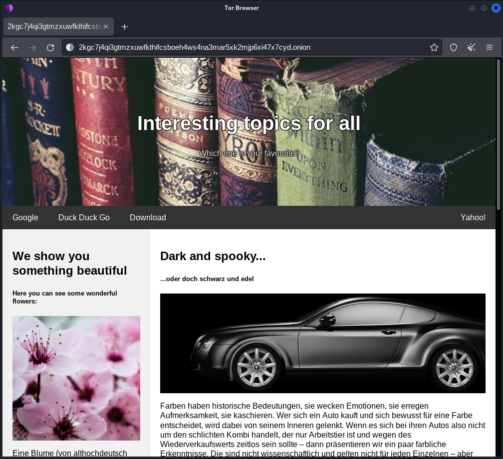

## TL;DR
lorem ipsum

## Complete Writeup

I once did a webchallenge about an *Alice in Wonderland* theme and that was about bruteforcing `/r/a/b/b/i/t` directories so just to not miss any hint, I look up exactly what `following the white rabbit means`:
> following the white rabbit means following an unlikely clue, an innocuous, unbelievable (but also, frankly a bit ridiculous) sign, to find oneself in the midst of more or less extraordinary, marvelous, amazing circumstances that challenge one's fundamental beliefs

Now I hope this challenge isnt about following guessy, unlikely clues too much, but let's start with the actual challenge.

We receive a link to a `.onion` site. Navigating to it with tor browser shows the website depicted in the description of the challenge.
Now in order to successfully enumerate this site and use any tools, we need to configure those tools to route the traffic through the tor network.
Therefore we first start the tor service:
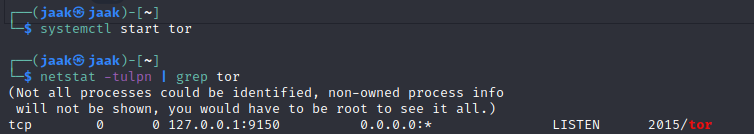

Having done this, I configure burpsuite to route the traffic through  tor:
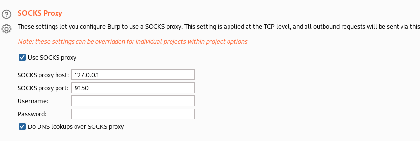

Now we can also tell gobuster to use tor as a proxy:
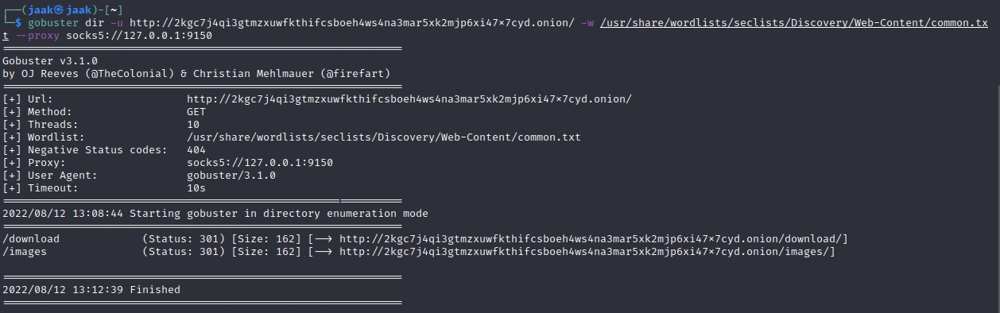
As we see, we already found 2 directories with gobuster.

Accessing both of those directories gives us a `403 Access denied` though.
Also additional bruteforcing of subdirectories reveals nothing. So I take a look at the traffic in burp. Navigating to the main site triggers several calls to images:

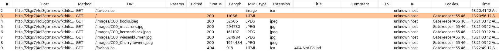

Also, the site sets a cookie:
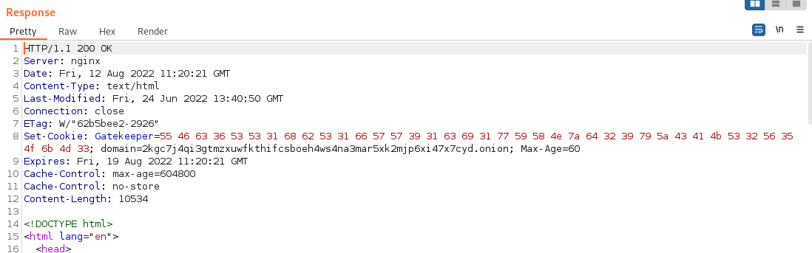

Looks like bytes. Decoding it looks like base64 which in turn reveals the following:

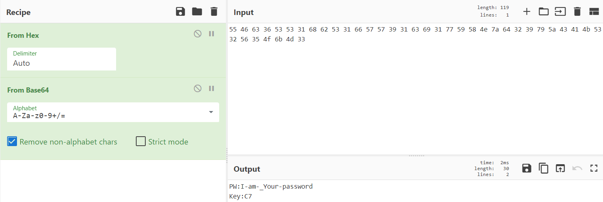

```
PW:I-am-_Your-password
Key:C7
```

Looking at the response html, we can find text `Tag:jqmjrqappoWoqaK0h6uotLO0oqqu6aSoq6ip` (invisible in browser; the `t` id assigned to it is called in an onload eventlistener disabling display of that element). Might be useful later on.

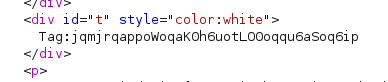


Also in the response html, there is an interesting element (invisible looking at the page in browser). Maybe we can also use that later on.

Also, there are links to `download/CyberSecurityChallenge_Matrix.exe` (visible in browser) and `cat:j2qmlapokqaHk0h6uoAEtLq6aSo36ipO` (invisible in browser).

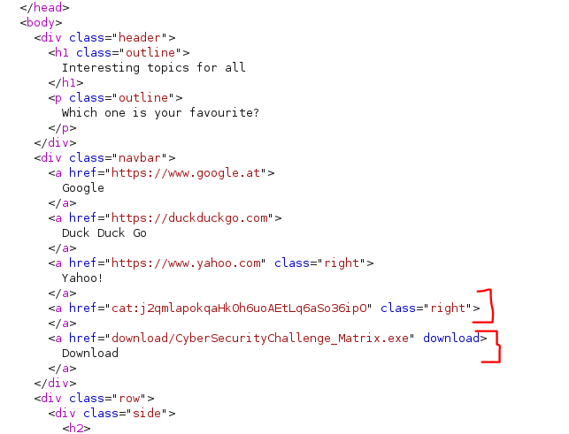

When accessing the CyberSecurityChallenge_Matrix.exe file, we get a `401 Unauthorized`. The browser prompts us for credentials:
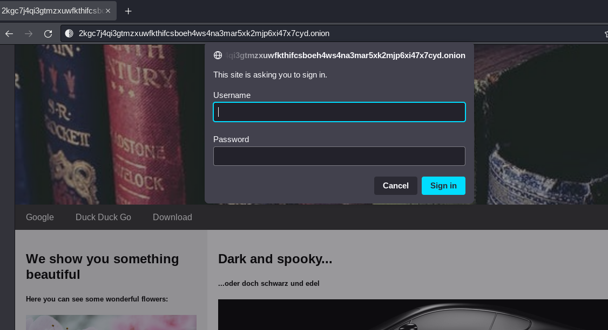

(Note: if you are using the tor browser for this, it should just show the popup; but if youre running this traffic through burpsuite, it will fail to do so. In order to fix this, in burp you need to go to `User options` -> `Connections` -> `Platform Authentication` and tick `Prompt for credentials on platform authentication failure`; this will then cause burp to prompt you with required authorization, otherwise it will just show a failed download of the .exe file)

I tried the stuff I found until now that I haven't used yet. However, none of the potential credentials worked, but maybe I missed something.

Then I decided to take a closer look at the two weird strings I found in the html:

- `Tag:jqmjrqappoWoqaK0h6uotLO0oqqu6aSoq6ip`
- `cat:j2qmlapokqaHk0h6uoAEtLq6aSo36ipO`

The two strings are oddly similar to one another, so I am thinking this is some kind of encoding or something of the sort. It looks like base64 at first, but decoding it just gives random nonsense:
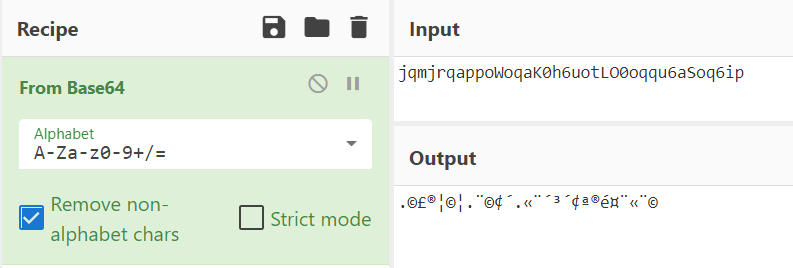

Not giving up on the idea that it is some encoding/encryption, I tried the tool ciphey (https://github.com/Ciphey/Ciphey)
> [Ciphey is a] fully automated decryption/decoding/cracking tool using natural language processing & artificial intelligence, along with some common sense.
> 
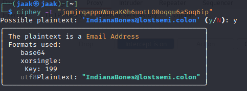

It looks like the string was the encoded version of what looks like an email address `IndianaBones@lostsemi.colon`. If we look at how the encryption/encoding takes place, it is first XORed with key 199 and then base64ed. And since 199 (in decimal) equals to C7 (in hex), we now also know what the line `Key:C7` meant that we got from the cookie.

Okay so, now we have a password (obtained from the cookie) and a potential username (the email address) to use on the download:

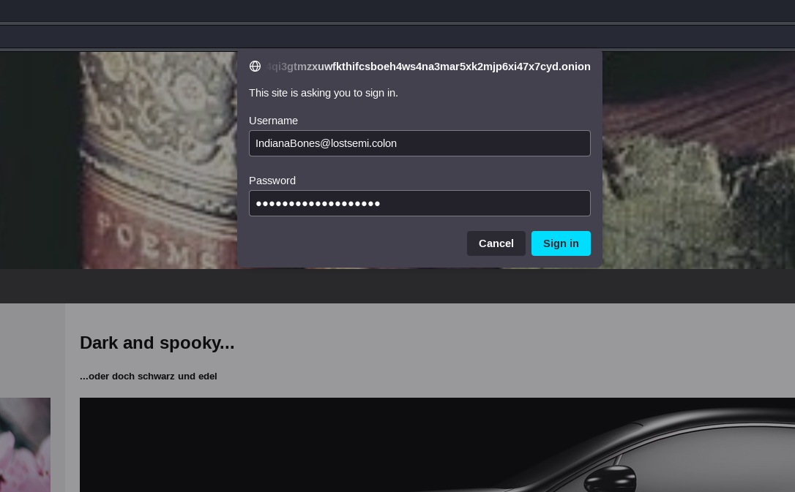

And indeed, we can download the file:
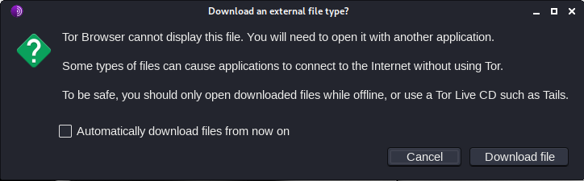


The file is a PE32 Windows executable:

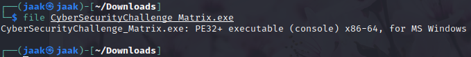

This means that (if we're on linux) we can execute it via wine. Before doing that however, I run the `strings` command on it and see if the flag is somewhere in there. From the challenge description, I know what I am looking for:
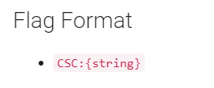

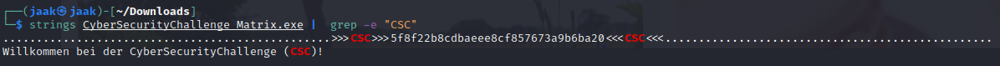

Even though what I find is not really in the flag format, it still looks like something I will need.

First I think it might be another encoded/encrypted piece of text. However, ciphey does not find anything.

After being stuck on it for a while, I go back over what I found previously and remember that I only used one encoded string up until now (the one that gave me the email address). Since the 2 strings look somewhat similar, I try the same decryption algorithm (base64, XOR with key C7) on the second one, but no luck - it doesnt decrypt to anything that makes sense.

After scanning it online with virustotal, I execute the file using wine:

After saying `Connecting...` and loading shortly, it prints random chars to the terminal

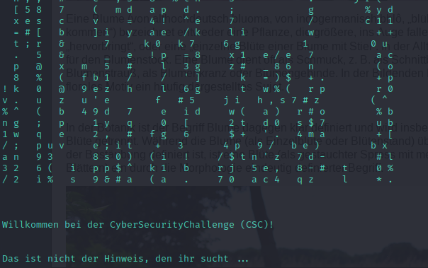

Now, it displays a Welcome-To-The-Challenge message and says that "this is not the hint you're looking for ..." in German.
So no direct luck there.

Playing around a little with the string I found using the `strings` command, I decide to try it as directory (after all it is still a web challenge and apart from using the tor browser), up until now it did not have to do that much with web. And indeed, in said directory, we find the flag:


`CSC:{e68e11be8b70e435c65aef8ba9798ff7775c361e}`


## Lessons learned
Even though I am familiar with how the theoretical concept and practical implementation behind TOR works, I am not that familiar with actually interacting with the darknet, so I definitely learned something there - especially in relation to routing certain traffic (gobuster, burpsuite) over TOR.


## Final thoughts

Even though I learned something, I was a little disappointed with what the challenge was about. Since the challenge was marked as a `web` challenge, I expected more sorts of actual web vulnerabilities. Of course the disappointment might come from the fact that I like web and that web is by far my best category, but in the end, this challenge was (apart from the TOR traffic routing) solely guessy encoding stuff.