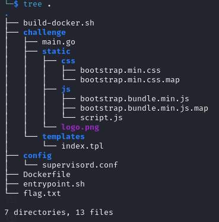
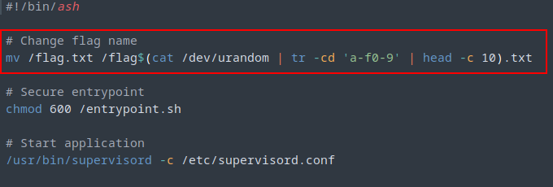
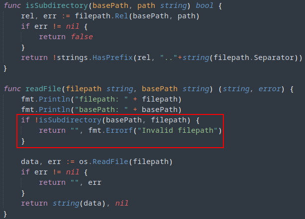
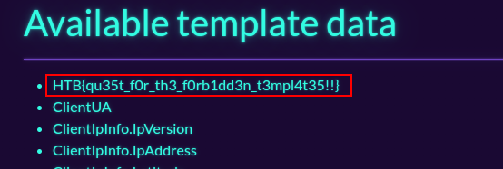

## Description
> You've found a website that lets you input remote templates for rendering. Your task is to exploit this system's vulnerabilities to access and retrieve a hidden flag. Good luck!
## TL;DR
Exploiting method confusion in Go's html/template package for RCE.
## Complete Writeup

When visiting the website, we are greeted with the following screen, automatically requesting a `/render` endpoint with a GET parameter `page` set to `index.tpl`:


To get an idea of what we're dealing with, let's look at the files we got for download:

Seems like the most interesting one will be `main.go`. We also detect the `index.tpl` file that has put as GET request parameter to the `/render` endpoint.

So what does this web application seem to do? Let's take a look at the code in `main.go`:
```go
package main

import (
	"encoding/json"
	"fmt"
	"html/template"
	"io"
	"net/http"
	"os"
	"os/exec"
	"path/filepath"
	"strings"
)

const WEB_PORT = "1337"
const TEMPLATE_DIR = "./templates"

type LocationInfo struct {
	IpVersion     int     `json:"ipVersion"`
	IpAddress     string  `json:"ipAddress"`
	Latitude      float64 `json:"latitude"`
	Longitude     float64 `json:"longitude"`
	CountryName   string  `json:"countryName"`
	CountryCode   string  `json:"countryCode"`
	TimeZone      string  `json:"timeZone"`
	ZipCode       string  `json:"zipCode"`
	CityName      string  `json:"cityName"`
	RegionName    string  `json:"regionName"`
	Continent     string  `json:"continent"`
	ContinentCode string  `json:"continentCode"`
}

type MachineInfo struct {
	Hostname      string
	OS            string
	KernelVersion string
	Memory        string
}

type RequestData struct {
	ClientIP     string
	ClientUA     string
	ServerInfo   MachineInfo
	ClientIpInfo LocationInfo `json:"location"`
}

func (p RequestData) FetchServerInfo(command string) string {
	out, err := exec.Command("sh", "-c", command).Output()
	if err != nil {
		return ""
	}
	return string(out)
}

func (p RequestData) GetLocationInfo(endpointURL string) (*LocationInfo, error) {
	resp, err := http.Get(endpointURL)
	if err != nil {
		return nil, err
	}

	defer resp.Body.Close()

	if resp.StatusCode != http.StatusOK {
		return nil, fmt.Errorf("HTTP request failed with status code: %d", resp.StatusCode)
	}

	body, err := io.ReadAll(resp.Body)
	if err != nil {
		return nil, err
	}

	var locationInfo LocationInfo
	if err := json.Unmarshal(body, &locationInfo); err != nil {
		return nil, err
	}

	return &locationInfo, nil
}

func isSubdirectory(basePath, path string) bool {
	rel, err := filepath.Rel(basePath, path)
	if err != nil {
		return false
	}
	return !strings.HasPrefix(rel, ".."+string(filepath.Separator))
}

func readFile(filepath string, basePath string) (string, error) {
	fmt.Println("filepath: " + filepath)
	fmt.Println("basePath: " + basePath)
	if !isSubdirectory(basePath, filepath) {
		return "", fmt.Errorf("Invalid filepath")
	}

	data, err := os.ReadFile(filepath)
	if err != nil {
		return "", err
	}
	return string(data), nil
}

func readRemoteFile(url string) (string, error) {
	response, err := http.Get(url)
	if err != nil {
		return "", err
	}

	defer response.Body.Close()

	if response.StatusCode != http.StatusOK {
		return "", fmt.Errorf("HTTP request failed with status code: %d", response.StatusCode)
	}

	content, err := io.ReadAll(response.Body)
	if err != nil {
		return "", err
	}

	return string(content), nil
}

func getIndex(w http.ResponseWriter, r *http.Request) {
	http.Redirect(w, r, "/render?page=index.tpl", http.StatusMovedPermanently)
}

func getTpl(w http.ResponseWriter, r *http.Request) {
	var page string = r.URL.Query().Get("page")
	var remote string = r.URL.Query().Get("use_remote")

	if page == "" {
		http.Error(w, "Missing required parameters", http.StatusBadRequest)
		return
	}

	reqData := &RequestData{}

	userIPCookie, err := r.Cookie("user_ip")
	clientIP := ""

	if err == nil {
		clientIP = userIPCookie.Value
	} else {
		clientIP = strings.Split(r.RemoteAddr, ":")[0]
	}

	userAgent := r.Header.Get("User-Agent")

	locationInfo, err := reqData.GetLocationInfo("https://freeipapi.com/api/json/" + clientIP)

	if err != nil {
		fmt.Println(err)
		http.Error(w, "Could not fetch IP location info", http.StatusInternalServerError)
		return
	}

	reqData.ClientIP = clientIP
	reqData.ClientUA = userAgent
	reqData.ClientIpInfo = *locationInfo
	reqData.ServerInfo.Hostname = reqData.FetchServerInfo("hostname")
	reqData.ServerInfo.OS = reqData.FetchServerInfo("cat /etc/os-release | grep PRETTY_NAME | cut -d '\"' -f 2")
	reqData.ServerInfo.KernelVersion = reqData.FetchServerInfo("uname -r")
	reqData.ServerInfo.Memory = reqData.FetchServerInfo("free -h | awk '/^Mem/{print $2}'")

	var tmplFile string

	if remote == "true" {
		tmplFile, err = readRemoteFile(page)

		if err != nil {
			fmt.Println(err)
			http.Error(w, "Internal Server Error", http.StatusInternalServerError)
			return
		}
	} else {
		tmplFile, err = readFile(TEMPLATE_DIR+"/"+page, "./")

		if err != nil {
			fmt.Println(err)
			http.Error(w, "Internal Server Error", http.StatusInternalServerError)
			return
		}
	}

	tmpl, err := template.New("page").Parse(tmplFile)
	if err != nil {
		fmt.Println(err)
		http.Error(w, "Internal Server Error", http.StatusInternalServerError)
		return
	}

	fmt.Println(reqData)

	err = tmpl.Execute(w, reqData)
	if err != nil {
		fmt.Println(err)
		http.Error(w, "Internal Server Error", http.StatusInternalServerError)
		return
	}
}

func main() {
	mux := http.NewServeMux()

	mux.HandleFunc("/", getIndex)
	mux.HandleFunc("/render", getTpl)
	mux.Handle("/static/", http.StripPrefix("/static/", http.FileServer(http.Dir("static"))))

	fmt.Println("Server started at port " + WEB_PORT)
	http.ListenAndServe(":"+WEB_PORT, mux)
}

```

As the description says, it seems the web application renders HTML templates. It supports loading templates either from a local directory (`./templates`) or remotely via a URL.
For each request, it fetches the location information of the client's IP address using an external API (`freeipapi.com`). The application also collects information about the server itself, such as hostname, operating system, kernel version, and memory, using shell commands. The `/render` endpoint handles the main logic. It fetches the requested page (template) and decides whether to load it from a local directory or a remote URL based on the query parameter `use_remote`.
The application also constructs a `RequestData` object containing client IP, user agent, client IP location info, and server info, which is then passed to the template for rendering. This `RequestData` object (instantiated as `reqData`) is later also used as data parameter in the `.Execute()` of the template: `tmpl.Execute(w, reqData)`.
Let's see if we can provide a template that will be rendered by the server. As an example, let's take their `index.tpl` file and change it so that something will be rendered. The only change I made is instead of the line `<li>ServerInfo.OS</li>` I put `<li>{{ .ServerInfo.OS }}</li>` (you can call any of the properties of the object that is being rendered (`reqData` object in the data parameter of the `Execute()` function) by putting a `.` and then the name of the property, e.g. `.ServerInfo.OS` here).
I copy the file into another directory, start a python http server and tunnel that using ngrok. I provide the url to my index.tpl to the web app and indeed instead of this

we got this

So it seems it is being rendered properly. Now apart from template injection, there is one other thing that stands out: Can we just tell it to "render" the flag file, à la path traversal in the `page` parameter?
There are 2 problems with that.
1. First of all, we got an entrypoint.sh script, executed by the Dockerfile on startup of the container, that changes the flag file name so that it incorporates 10 random characters, so we don't know what file we're looking for exactly:

2. Second, there is actually some code that verifies if the given path is within the allowed directory: 


So, onto template injection. Since we dont have to inject into a specific parameter that is being rendered in a fixed template, but we can provide the WHOLE template ourselves, this should be easy?!
Problem is, we are not dealing with a template package like Jinja2 for Python (where `eval()`could be called within the template) or EJS for Javascript (also allowing javascript execution if untrusted unescaped data is allowed within the template): We are dealing with html/template package for Golang. This package is designed to be secure by default and does not allow the execution of arbitrary code or external commands, which limits the scope of an attacker massively. So it seems like this challenge is not about finding a crack in the web app to inject a payload into the template, but to find a weakness in Go's html/template package itself, having complete control over the template.

Let's examine https://pkg.go.dev/html/template:

> Package template (html/template) implements data-driven templates for generating HTML output safe against code injection. It provides the same interface as [text/template](https://pkg.go.dev/text/template) and should be used instead of [text/template](https://pkg.go.dev/text/template) whenever the output is HTML.
> The documentation here focuses on the security features of the package. For information about how to program the templates themselves, see the documentation for [text/template](https://pkg.go.dev/text/template).

So far so good, much secure ok ok. A little further down, this stands out though:

> The security model used by this package **assumes that template authors are trusted, while Execute's data parameter is not**.

Seems like the assumption that the template authors are trusted is not so good for our web application. Can we find an exploit somewhere online about Go's html/template package that relates to this?

A quick google search finds this one: https://www.onsecurity.io/blog/go-ssti-method-research/. This resource describes a vulnerability in Go's html/template package, which allows a malicious user who has more flexible control over a template (more than just being able to control the `Execute()`'s data parameter'), to call methods that are an attribute of the value passed to the template:

> Upon experimenting with the previously stated functionality (you can call any of the properties of the object that you render into the template), I was wondering if you could equally call a method through a template injection, as long as the method is an attribute of the value passed to the template. This lead me to finding out that you can in fact call methods, and **even specify explicit parameters**, similar to how you would in a deserialization attack.

In our example, the methods `FetchServerInfo` and `GetLocationInfo` ARE in fact attributes/methods of the `reqData` object. This is defined by the method receiver in the function definition: `FetchServerInfo` belongs to `RequestData` type (the object type of `reqData`).

```go
func (p RequestData) FetchServerInfo(command string) string {
	out, err := exec.Command("sh", "-c", command).Output()
	if err != nil {
		return ""
	}
	return string(out)
}
```

This means we can call this function and as the resource says, even specify explicit parameters.

The FetchServerInfo method has a parameter that is being executed as a system command, so according to the resource, this should allow us to get the flag in no time. The payload I built looks as follows:
{{.FetchServerInfo "cat / \`ls / | grep -e flag\`"}}
This also provides an easy workaround with the issue of the random name of the flag file. Using this payload in a template provided to the web app gives us the flag:



`- HTB{qu35t_f0r_th3_f0rb1dd3n_t3mpl4t35!!}`
## Final Solution

1. Put 
{{.FetchServerInfo "cat / \`ls / | grep -e flag\`"}}
into template file.
2. Serve via python http server tunneled via ngrok.
3. Provide url to web app
4. Get flag :)
## Lessons learned
This challenge was a refrech for some SSTI stuff. Also I got to know some Golang and of course Go's html/template features. Pretty nice challenge.
