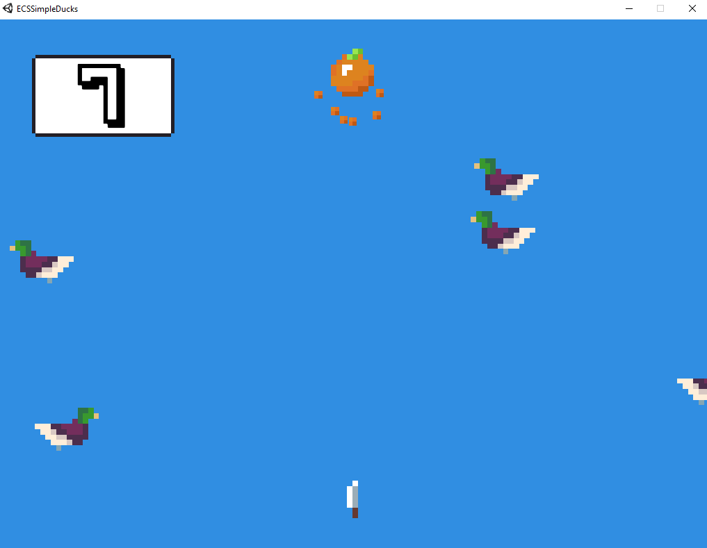
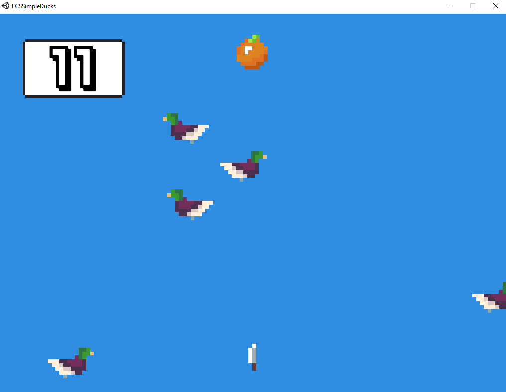
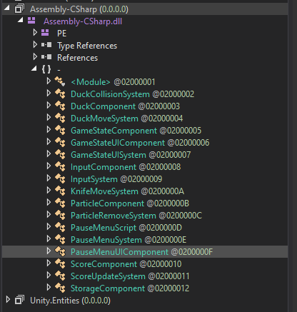
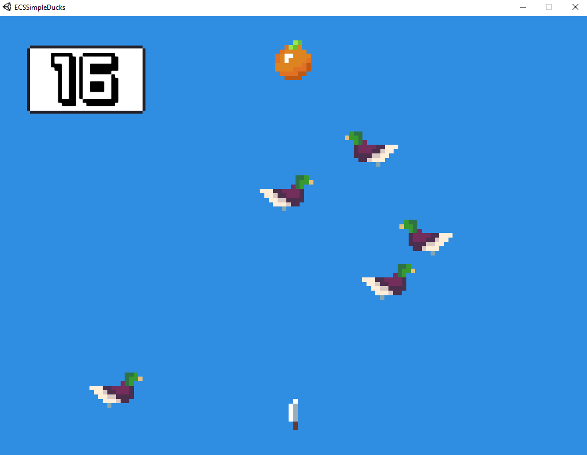
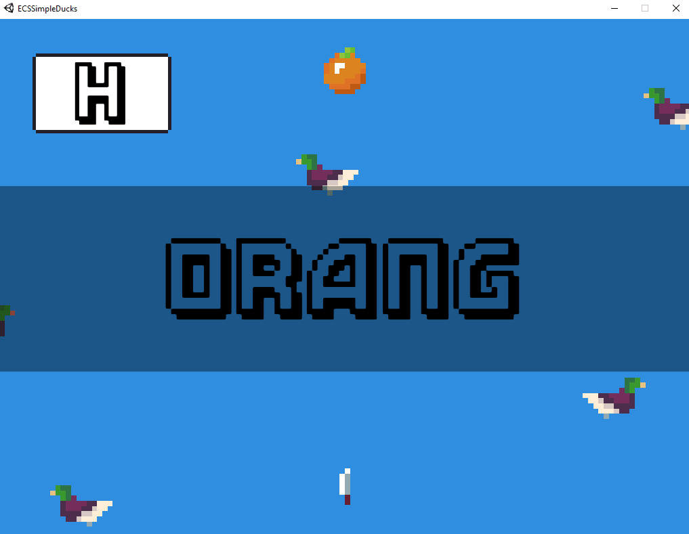
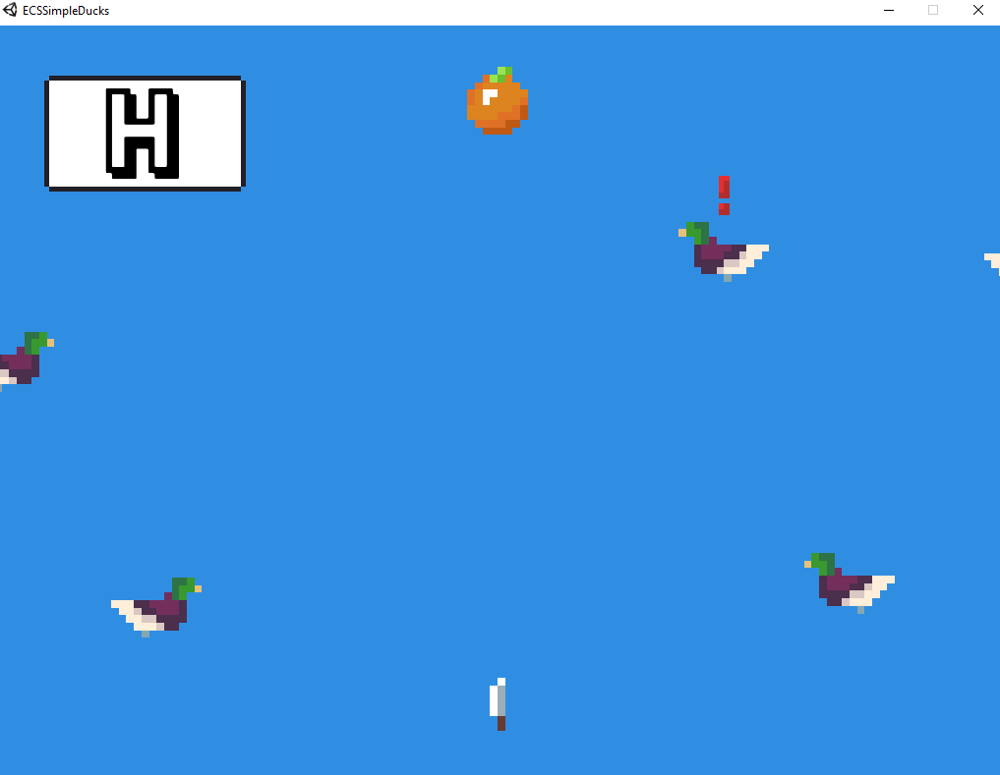

# Gamer R


## TL;DR
Reverse a Unity game and patch it to get the flag
## Description
This challenge was the last Reversing challenge for TJCTF and gave 80 points. The challenge provided you with a folder that contained a binary as well as several Unity related files and libraries. The game itself was pretty simple. All you had to do was hit space to shoot a knife and hit an orange, all while trying to avoid hitting the ducks swimming randomly in between.
If you manage to hit the orange, your score gets increased by 1.



When hitting a duck, your score gets reset to zero,



which means that we probably need to reach a certain score to get the flag. Unity games are normally written in C# which is an interpreted language that generates a bytecode instead of machine code which means that we can easily decompile it. I'll use dnSpy to decompile the program. 

## Reversing
Unity stores the game logic in *Projectname*_Data/Managed/Assembly-CSharp.dll so let's open it in dnSpy



Let's try to make the game easier by changing the duck collision behaviour described in the class DuckCollisionSystem.
The important part of the code looks like this:
```csharp
if  (Vector2.Distance(this.ducks.Transforms[i].position,  this.knife.Transforms[j].position)  <  this.hitBoxRadius)
{
	...
	collision()
	...
}
private  float  hitBoxRadius  =  0.6f;
```
The code basically checks if the distance between a duck and the knife is smaller than  the specified hitbox radius. If yes, a collision is detected. We can easily bypass this check by changing the value of the hitBoxRadius variable
```csharp
private  float  hitBoxRadius  =  -1.0f;
```

After recompiling the code, we can now shoot as many knives as we want without hitting any duck. While I was playing the patched version, I noticed that the score showed a letter instead of a number every multiple of 20, so I played a while to see if the flag would show up. 



The issue however was that the encoded text was really long and it took me ages to reach each character. So I decided to take a look at the KnifeMoveSystem class which also dealt with increasing the score
```csharp
if  (this.knife.Transforms[i].position.y  >  4f)  
{  
	...
	this.score.ScoreComponents[k].Score++;  
	this.score.ScoreComponents[k].CumScore  += (double)this.score.ScoreComponents[k].Score;
	...
}
```
The code checked if a knife had reached the orange and increased the score by one and the CumScore by score. I decided to try and change the value by which Score is increased to 20 and recompiled the code
```csharp
this.score.ScoreComponents[k].Score += 20;  
```
However this led to an issue and the characters didn't show up right



So I took a look inside the scoreUpdateSystem class to see what the problem was about
```csharp
if  (this.text.ScoreComponents[i].Score  /  20  <  this.text.ScoreComponents[i].TextSeq.Length  &&  this.text.ScoreComponents[i].Score  %  20  ==  0)  
{  
	this.text.Texts[i].text  =  ((char)(this.text.ScoreComponents[i].TextSeq[this.text.ScoreComponents[i].Score  /  20]  ^  (int)(this.text.ScoreComponents[i].CumScore  %  4096.0))).ToString();  
}
```
This part checked whether the score was divisible by 20 and if so, it xored a value in the TextSeq array with the CumScore value and put the result into the UI score field. That meant that I had to fix the cumScore value as well when I increased the score by 20 as the cumScore would have normally increased by every integer between 0 and 20. A quick way to do this is to use the formula to calculate a triangular number which basically sums up to :
cumScore = ((score)*(score+1))/2
Implemented in C# this gives us:
```csharp
this.score.ScoreComponents[k].CumScore  =  (double)this.score.ScoreComponents[k].Score  *  ((double)this.score.ScoreComponents[k].Score  +  1.0)  /  2.0;
```
Recompiling the game gives us a working patch that gets us the flag way faster



The letters found in the score field build up following text:
HERE'S THE FLAG YOU'RE LOOKING FOR! HAHA JKJK... UNLESS...? TJCTF{ORENJI_MANGGOE}
and we have our flag
