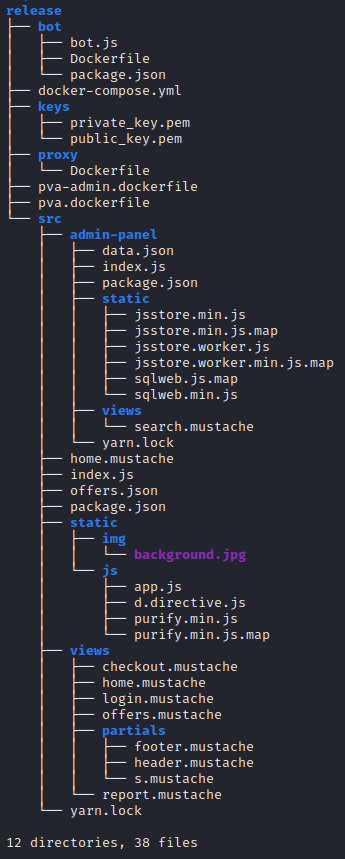
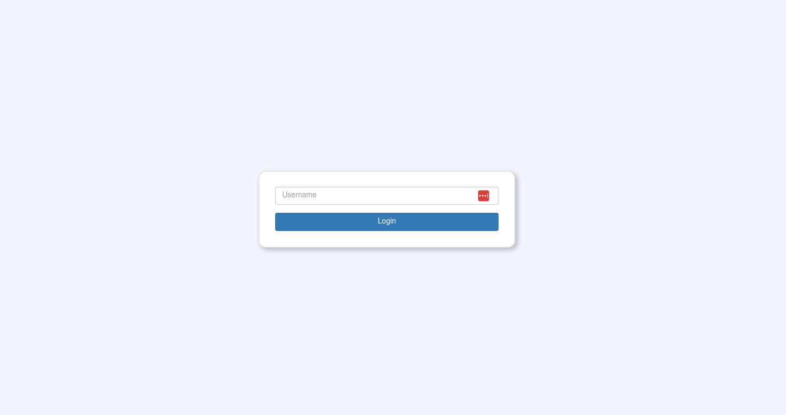

## Description
> The source code and the public key of a web application are provided. The flag format is FLG1{xxx}.

## TL;DR
Authentication bypass using vulnerable JWT through accepted untrusted user input in JWT header algorithm. 

## Complete Writeup

We get a zip file containing the public key as well as the source code of the web application. Let's look at what the folder looks like:



For this challenge (part 1 of the web challenge), mainly the `/src/index.js` will be important.

Let's first investigate the webapp manually to get a feeling of what we're working with, then look at the code. When connecting to the web app, we see a pretty empty page just asking for a username to log in:



Burpsuite reveals an interesting `/get_token` endpoint.


Looks like base64, decoded becomes:


So, looks like a JWT with a header including the algorithm, the body including a field `login_permissions` set to `false` and a signature at the end. When trying to log in, this JWT is sent in an `Authorization` header in the request and Login fails.


Ok, so now let#s have a look at the code to understand what's happening underneath. This is `index.js`:

```javascript
const express = require('express');
const jwt = require('jsonwebtoken');
const fs = require('fs');
const bodyParser = require('body-parser');
const session = require('cookie-session');
const mustacheExpress = require('mustache-express');
const redis = require('redis');

const app = express();
const port = 3000;

app.engine('mustache', mustacheExpress(__dirname + '/views/partials'));

app.set('view engine', 'mustache');
app.set('views', __dirname + '/views');

app.use(bodyParser.json());
app.use(session({
  keys: [process.env.SESSION_SECRET], 
  httpOnly: true,
  sameSite: 'strict',
}));

app.use(require('morgan')('dev'));
app.use(express.static('static'));

const REDIS_URL = process.env['REDIS_URL'] ? process.env['REDIS_URL'] : 'redis://redis:6379'
const redisClient = redis.createClient(REDIS_URL);

const privateKey = fs.readFileSync('../keys/private_key.pem');
const publicKey = fs.readFileSync('../keys/public_key.pem');

const flags = {
  flag1: process.env.FLAG1,
  flag2: process.env.FLAG2,
};


const offers = JSON.parse(fs.readFileSync('offers.json'));

function redirectUnauthorized(req, res, next) {
  if (req.session.user == undefined) {
    return res.redirect("/");
  }
  next();
}

function verifyJwtToken(jwt_token) {
  const {header, payload, signature} = jwt.decode(jwt_token, {complete: true});
  const alg = header.alg;
  
  if (!alg || alg.toLowerCase() == "none") {
    // disabled for security reasons
    return;
  }

  try {
    return jwt.verify(jwt_token, publicKey, {algorithms: [header.alg]});
  }  catch {
    return;
  }
}

app.get('/', (req, res) => {
  if (req.session.user !== undefined) {
    return res.redirect('/home');
  }
  res.render('login');
});

app.get('/get_token', (req, res) => {
  res.send(jwt.sign({'login_permissions': false}, privateKey, {algorithm: 'RS256'}));
});

app.post('/login', (req, res) => {
  const user = req.body.user;
  const jwtToken = req.headers.authorization;

  if (jwtToken === undefined || user === undefined) {
    return res.sendStatus(400);
  }

  const payload = verifyJwtToken(jwtToken);

  if (payload === undefined) {
    return res.sendStatus(400);
  }

  if (payload.login_permissions !== true) {
    return res.sendStatus(401);
  }

  if (user.toLowerCase() === 'admin' && req.headers["admin-secret"] !== process.env.ADMIN_SECRET) {
    return res.sendStatus(403);
  }

  req.session.user = user;
  req.session.isAdmin = user.toLowerCase() === 'admin';

  return res.send(req.session.user);
});

app.get('/home', redirectUnauthorized, (req, res) => {
  res.render('home', homeParams(req.session.user, req.session.isAdmin));
});

app.get('/report', redirectUnauthorized, (req, res) => {
  res.render('report', {user: req.session.user, isAdmin: req.session.isAdmin});
})

app.post('/report', redirectUnauthorized, (req, res) => {
  if (req.body?.reportUrl === undefined) {
    return res.sendStatus(400);
  }
  // admin looks at it
  redisClient.lpush("links", [req.body?.reportUrl])
  return res.sendStatus(200);
});

app.get('/offers', redirectUnauthorized, (req, res) => {
  res.render('offers', {user: req.session.user, isAdmin: req.session.isAdmin, offers, offersString: JSON.stringify(offers)});
});

app.get('/checkout', redirectUnauthorized, (req, res) => {
  res.render('checkout', {user: req.session.user, isAdmin: req.session.isAdmin});
});

app.get('/logout', (req, res) => {
  req.session = null;
  res.redirect('/');
});

app.listen(port, () => {
  console.log(`PVA listening on http://0.0.0.0:${port}`);
});

function homeParams(user, isAdmin) {
  const vitamin = isAdmin ? flags.flag2 : flags.flag1;
  const price = isAdmin ? 1337.99 : 41.99;
  const specialOffer = {
    vitamin,
    price
  };
  const params = {user, specialOffer, isAdmin};
  if (user.toLowerCase().includes("admin")) {
    params["show"] = true;
  }
  return params;
}
```

As we can see, the `/login` endpoint checks for a JWT, verifies it, checks for `login_permissions` set to `true` and then checks if the user logged in with an `admin` username and if so, if the `admin-secret` was sent correctly as a second security mechanism for admin log in.

So, as we do not know the admin secret and the code does not show any way of getting my hands on that, I suspect the challenge for now is to log in as a normal user. What prevents that is the `login_permissions` set to false, they need to be true. However, this part is hardcoded into the JWT body. So naturally, there must be a way of tampering with the JWT so that I can change the body and bypass authentication that way.

Just changing the body won't work however, since the JWT is signed with the private key of the application, which I don't have (I was only provided with the public key which is used in verification of the signature).

The following part makes me suspicious:

```javascript
function verifyJwtToken(jwt_token) {
  const {header, payload, signature} = jwt.decode(jwt_token, {complete: true});
  const alg = header.alg;
  
  if (!alg || alg.toLowerCase() == "none") {
    // disabled for security reasons
    return;
  }

  try {
    return jwt.verify(jwt_token, publicKey, {algorithms: [header.alg]});
  }  catch {
    return;
  }
}
```

The verification of the JWT does not work with a hardcoded algorithm. When verifying, the algorithm to be used is read from the header of the individual JWT token sent to the backend.

A security check is being done however to make sure the algorithm can not be set to `None`, which would allow to skip verification of the signature completely.

So, what do we have/know?

- The "default" algorithm used by the webapp when creating the tokens is RS256, which is an asymmetric algorithm
- We can set the algorithm of the verification
- We have the public key of the web app
- The public key is used to verify the signature

This makes the JWT vulnerable. We can essentially change the body of the JWT to anything we want and change the algorithm in the header of the JWT to a symmetric one (e.g. HS256) as opposed to an asymmetric one, which makes sure that the same key is used for signing as for verification. As we know that the public key is used for verification, we can now use it for signing. The web app will then receive a JWT signed with the public key, will use the symmetric algorithm we defined in the header for verification along with the public key (which is hardcoded for verification). Therefore, the verification will now succeed.

So, I could of course manually change this stuff and manually sign. But as I got the whole source code and can start it in docker, I just start the source code locally, change the body and algorithm in the local code, swap the signing key to the public key, which makes the local web app now return a JWT with the right body and algorithm signed with the public key. This I can now provide to the actual web app for bypassing verification.


...becomes...


The endpoint returns this token (note that it is now much shorter, because of the symmetric algorithm signature)...


...which decodes to:

`{"alg":"HS256","typ":"JWT"}{"login_permissions":true,"iat":1676981563}...Õ³It&.öüèr.vi.âÓ.Ö¸+î,Ì..ü2r_`

Now, when I use this token to log into the actual application, the login succeeds:


`FLG1{5be40603e5915e91e18f309bfce18a7b78e2109c}`

## Lessons learned
Since I have already done a very similar challenge on portswigger, where exactly this attack is described in detail, it was just a refreshment of some concepts. I guess the challenge for me here was mainly identifying that the attack is possible by noticing the important parts in the code.

https://portswigger.net/web-security/jwt/algorithm-confusion
