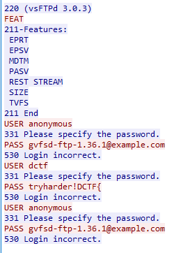
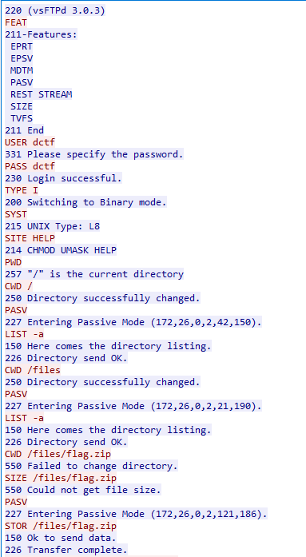
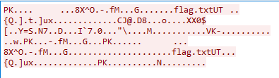
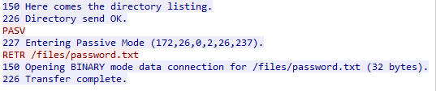
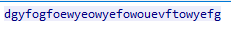

# hello-nemo
## TL;DR
Intercept unencrypted FTP traffic and extract a zip file as well as the password.
## Description
This was a challenge at the ENISA Hackfest 2020, which posed as a replacement for the ECSC 2020 that was supposed to be held in Vienna but unfortunately got cancelled due to Covid19. While this challenge wasn't that hard, it shows how weak unencrypted FTP is and is also a great introduction for wireshark.

## Solution
A first look at the packet capture shows that we are dealing with FTP communication.  Following the TCP stream when we see the first FTP packet, we see that someone was trying to authenticate as anonymous and we see a supposedly fake flag:

We can't find anything here so let's go on to the next FTP connection and see if we can detect more

This one is definitely longer, we can even see the plaintext password and username being transmitted and the user downloading a /files/flag.zip file. When FTP transmits a file, it opens a second TCP connection on which it transmits the data so we cannot see the transfer in this TCP stream. Let's check for newly opened connections shortly after the STOR command (wireshark already marks the connections as FTP-data)

We clearly see that this is a zip file (PK header) containing a flag.txt file. So let's save it as raw data and name it flags.zip. However, when trying to open the flag.txt file, it asks us for a password which we don't have yet. So let's take another look at the FTP connection:

A bit further down, we see the user requesting to download /files/password.txt so again let's take a look at the actual file:

And we can see the password in plaintext. Using this password to open flag.txt, we finally retrieve the flag.
DCTF{3907879c7744872694209e3ea9d2697508b7a0a464afddb2660de7ed0052d7a7}
