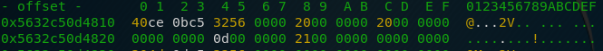

# s3-simple-secure-system
## TL;DR
Extract RSA keys from executable and decrypt encrypted document
## Description
This was a challenge at the ENISA Hackfest 2020, which posed as a replacement for the ECSC 2020 that was supposed to be held in Vienna but unfortunately got cancelled due to Covid19. This challenge was marked as easy. However, it took me quite some time to figure it out, mostly due to the different meanings that 'word' can have for different developers (more on that later). 39 people managed to solve this challenge with a final score of 120 points.
## Challenge Description
During an investigation we noticed that one of the employees used to this tool to encrypt some sensitive information. However, we were not able to recover the original information to see what has been leaked. Can you develop a decryptor for this?

Flag format: CTF{sha256}

Author: BIT SENTINEL
## Basic Dynamic Analysis
Let's begin by running the executable through ltrace and check if we can find anything interesting. We need to provide a valid file as an argument or the executable won't run completely. When doing that, we get the following output:
```
strlen("")                                       = 0
strlen("")                                       = 0
fopen("flag.txt", "r")                           = 0x55a9844142a0
__isoc99_fscanf(0x55a9844142a0, 0x55a9837e0e02, 0x7fffa6c9c5c0, 1) = 1
fclose(0x55a9844142a0)                           = 0
BIO_new_mem_buf(0x7fffa6c9b100, 1193, 0, 0x55a984414010) = 0x55a984414490
d2i_PrivateKey_bio(0x55a984414490, 0x7fffa6c9b0e0, 0x7fffa6c9b0e0, 0x55a984414620) = 0x55a98442cc00
EVP_PKEY_get1_RSA(0x55a98442cc00, 3, 0x55a98442c750, 0x55a984414010) = 0x55a98442cdf0
RSA_check_key(0x55a98442cdf0, 3, 0x55a98442c750, 0x55a984414010) = 1
RSA_public_encrypt(0, 0x7fffa6c9c5c0, 0x7fffa6c9b5b0, 0x55a98442cdf0) = 256
fopen("encrypted.txt", "wb")                     = 0x55a9844142a0
fwrite("\221\375\370w\333z\027NH\021\300\227\313", 1, 256, 0x55a9844142a0) = 256
fclose(0x55a9844142a0)                           = 0
RSA_free(0x55a98442cdf0, 1, 0, 0x55a984414010)   = 1
EVP_PKEY_free(0x55a98442cc00, 1, 0, 0x55a984414010) = 0
BIO_free_all(0x55a984414490, 2, 0x55a98442c110, 0x55a984414010) = 1
+++ exited (status 0) +++
```
A few things to note here are that the executable opens flag.txt and encrypted.txt, scans from flag.txt and writes to encrypted.txt. We can assume that it does something to the content of flag.txt and writes the output to encrypted.txt, so we need to reverse that process. A last thing to note is the utilisation of several RSA functions like RSA_public_encrypt and RSA_check_key that are probably used for the encryption.
## Reverse Engineering
When we open the file in radare2 we get a similar picture to when we ran it through ltrace. At this point, it is probably a good bet to try to extract the RSA keys out of the running executable and use them to decrypt the file. In order to do that, we need to find out where they are saved and used so we can analyse the memory at that address. A quick web search for RSA_public_encrypt reveals that the function is part of the OpenSSL toolkit for C: https://www.openssl.org/docs/manmaster/man3/RSA_public_encrypt.html. The function description looks like this: 


Looking into the preparation for the call in the executable,  we see the following


Putting this information together with the C calling convention on x86-64 systems that puts arguments consecutively into rdi, rsi, rdx, rcx and r8 , we know that rcx must point to an RSA object before the call to RSA_public_encrypt so the RSA object is saved in the variable var_24d8. Let's take a look at what this variable points to just before the program executes the encryption function:


While we can't see any clear indication of an RSA key, there seem to be several pointers to objects. Let's check what an RSA object looks like (we can find this again in the docs for OpenSSL at https://www.openssl.org/docs/man1.0.2/man3/rsa.html):


As we can see, the RSA object is a struct containing addresses to several BIGNUMs, each BIGNUM representing one factor of the RSA key (I still don't know why the RSA object in memory has 24 bytes that are not used for anything). In my first run through, I extracted p,q and n to check if I extracted in the right way, however, as only the private key d and the public key n are needed to decrypt the file and the process is the same, we will focus on d for this writeup. So let's look what the address that's designated as d (0x5632c50d4810) points to:



Again, what looks like another struct and still no key in sight. As we know from earlier, this struct is a BIGNUM so let's search what that looks like: https://www.openssl.org/docs/man1.0.2/man3/bn_check_top.html. (This took me some time and I found conflicting sources on this so I lost most of my time here.)


It finally looks like we're close to the end. The first field (0x5632c50bce40) is a pointer to an array of chunks and the third field contains the size of the array. In our case that means the size is 0x20 = 32. However, what does that 32 mean? 32 bytes? 32 words? 32 double words? So I had to look for another source that clarifies this. I found the following webpage: https://linux.die.net/man/3/bn_internal that seemed to solve my problem. I quote directly:
The integer value is stored in **d**, a _malloc()_ed array of words ( **BN_ULONG** ), least significant word first. A **BN_ULONG** can be either 16, 32 or 64 bits in size, depending on the 'number of bits' ( **BITS2** ) specified in "openssl/bn.h". 
However, as I was already quite tired, I didn't even read the second part that specified that in this case, a word can have different sizes (2, 4 or 8 bytes) and just assumed that it was 2 bytes because that's what I was used to. So after extracting p and q and checking that they were indeed not prime, I knew that something had gone wrong and I went back to the defintion of a "word" and took a look at the array in memory. I wish I had done this earlier because you could easily see where it stopped: 


We cleary see that we get a lot of 0x00 bytes after an array size of 256 bytes. Divide that by the earlier established length of 32 and we see that in this case, a word is 8 bytes long (I still think that's weird). 256 bytes is quite safe for an RSA key though so I guess this would closely remember real life conditions. Now that we know that the key is 256 bytes long, we just need to extract it (easier said that done, this involved a lot of copy-pasting and reversing the bytes because of endianness). After doing that we finally get d which is the glorious number
```
13242780575016631121007479458750836510201287903770587799422460380939567854868574792397941824867360331144478429113840623971492738297234451139859241839168378713484112202543233717163557823499902460065918395255054938719512509645605536663786638012933431481065441250286873370736039376072124019805982690045324448840584099629026161825831273851957612805673365273520117577764033680727193566316713813055607197671025790385182072240740451394950345647793538733126077154308585814366642816043725010389255832688248284885710351416852440042663301147377791076232453145659185003475038106730305346131734111066504896486992177730814699913985
```
Doing the same for n, we get 
```
24677759121523641666736818825902174425461679471961472109265255935216709559683863236639765514411333675174604987597991781774281884323860622262587936319303307905985619762235943817616312351181810899523446611215290042903144568928432712227660294448338545280633109363929904748441178668419312231966353537419330330793495007040123186586486143837302323885733197008630567172471971841027861712951190275075531165655055520235384630893075777672420016071702164555300181008372286489221013065438746310174580938927903748737004904042045912024248087581766732714598781661338003772040007474963065518714021592324888601144706354320303587618037
```
That's all we need in order to decrypt the file. The remaining work is writing a simple RSA decryption script in python:
```python
n = ***
d = ***

f = open("encrypted2.txt","rb")
data = f.read(256) #encrypted file is 256 bytes long
secret = int.from_bytes(data, "big")

decrypted = pow(secret,d,n) #this is the whole RSA decryption
result = ""
while(decrypted>1):	#translating the resulting number into ascii text
	ascii = decrypted%256
	
	result += chr(ascii)
	decrypted = decrypted//256


print(result[::-1])
```
And finally, running this script gives us:
```
ÌN`\¯ÖïëKò%è,Ô(Æv§èxÒò· 1Hm`aoza­9YNÕ×=ÛOÚÇ�C0kì¡4=K¡qJÅðÿìfókAFH|µµÿsðY4uu½¢¾Fö"¥æ
                             ~è·+î¶>Rð6-Yº3ê[ré	ÀCTF{67131493f75e92a06c5524b7c4c2be3513d992dafeb03e0e0296df0c5716155b}
```
so the flag is CTF{67131493f75e92a06c5524b7c4c2be3513d992dafeb03e0e0296df0c5716155b}
