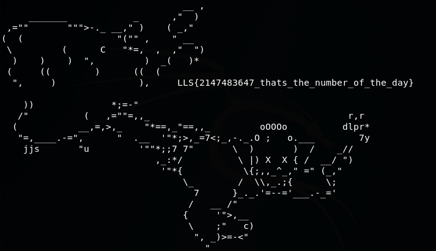
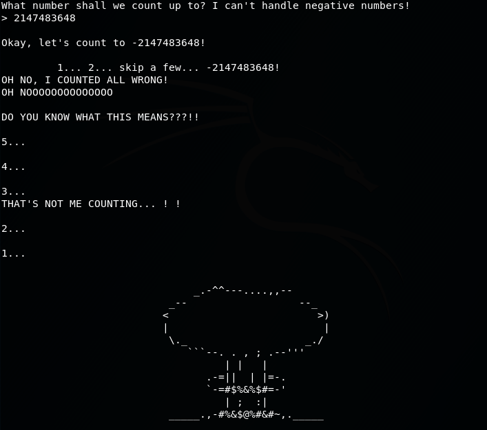

# Count Dracula


## TL;DR
Exploit the C implementation of integers to enter a negative number

## Description
Upon connection to the service that is provided, we are greeted by Count Dracula that asks us for a number to count up to and says that he can't handle negative numbers


When trying to directly enter a negative number, Dracula says that he can't count to that so we need to find another way.
In the C language, integers can be represented in two ways:
```C
int x = 5;
unsigned int x = 5;
```
Both are represented with 32 bits. The normal integer however can represent both negative and positive numbers, while an unsigned int only represents positive numbers.

In this case, a normal int was used. A normal int uses the most significant bit to tell wether a number is positive (0) or negative (1), which means that positive numbers can only go up to 2**31 - 1 = 2147483647. Anything beyond will need the first bit to be represented and will thus appear as a negative number. With that in mind, when we try to enter 2147483648, we actually get -2147483648 which the service accepts. We are then treated to a nice ASCII sequence during which the program "explodes" and get the flag at the end




