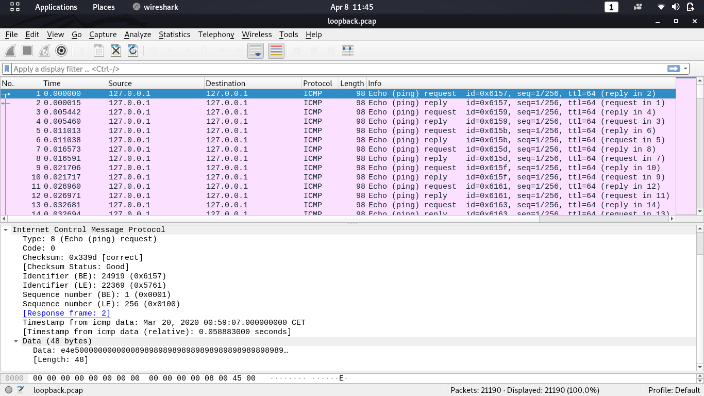

# loopback


## TL;DR
Extract every 70th byte from the data padding of every second packet and put it into a file.
The file is a picture and contains the flag.

## Description
The challenge is network forensic challenge. Thus, we were provided with a pcap file, namely *loopback.pcap*

First thing to do it to take a look at it in wireshark.


It seems like some data is embedded in the data field.
Trying to extract data with *foremost* or *binwalk* did not yield any results.
So lets take a closer look at single packets and their content.

It is noticeable that all the packets have the exact same size.
The data field always contains 48 bytes.
From Wikipedia we know, that the first 8 bytes are ICMP specific, the rest seems to be some kind of payload of padding.
Thus we can ignore the first 8 bytes and take a look at the padding bytes.

As the ICMP request and reply contain the same padding bytes, we have information gain of one byte per 2 packets.
As the file contains 21190 packets, we have 10595 bytes of information.

As there are also non-ascii bytes, it can be deduced that the resulting file is not a text file.


## Extracting the bytes

The padding bytes of the first few packets result in: `\x89 \x59 \x4e \x47 \x0d`.
Which looks exactly like the file signature of a .png file.

To extract one byte of padding of every second packet, I wrote a little python script which does exactly that:

```python
import dpkt

#open the pcap file
pcap_content = open("./loopback.pcap", "rb")
#open the ouput file
out = open("flag.png", "wb")
#read in the file as series of packets
pcap = dpkt.pcap.Reader(pcap_content)
#set count variable to only get every second packet
count = 0
for cap in pcap:
	if count % 2 == 0:
		#write out the relevant byte of every second ICMP packet.
    # I chose to extract the 70th byte, but any other in the correct range is also fine
		out.write(cap[1][70])
	count +=1

```

After running the script, we can open the flag.png to view the flag:


