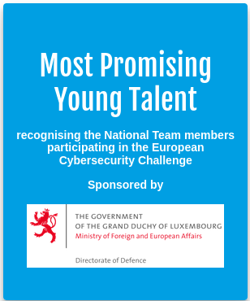

Its officiall. LetzPwn is an officially registered NPO.
We are hoping that we can have more impact as an NPO, acquiring talents at a younger age by cooperating with different institutions.
If you are a sponsor, or if you want to have contact us regarding a CTF workshop or other, feel free to contact us at: LetzPwn@protonmail.com.

Furthermore, the national CTF team which participated in the ECSC2022 got rewarded with the Most Promising Young Talents award by LHC.

