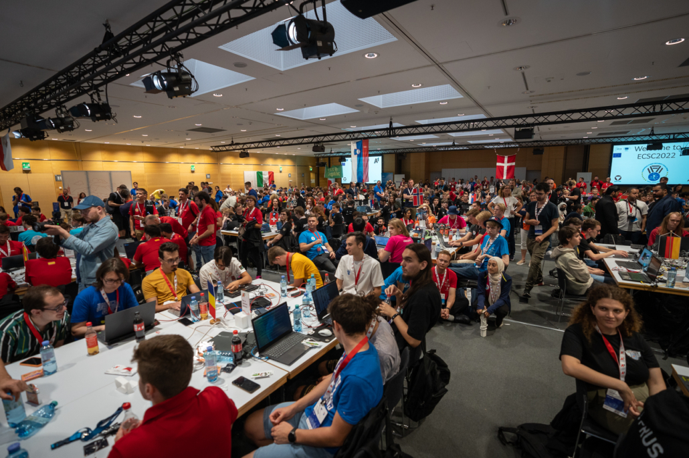
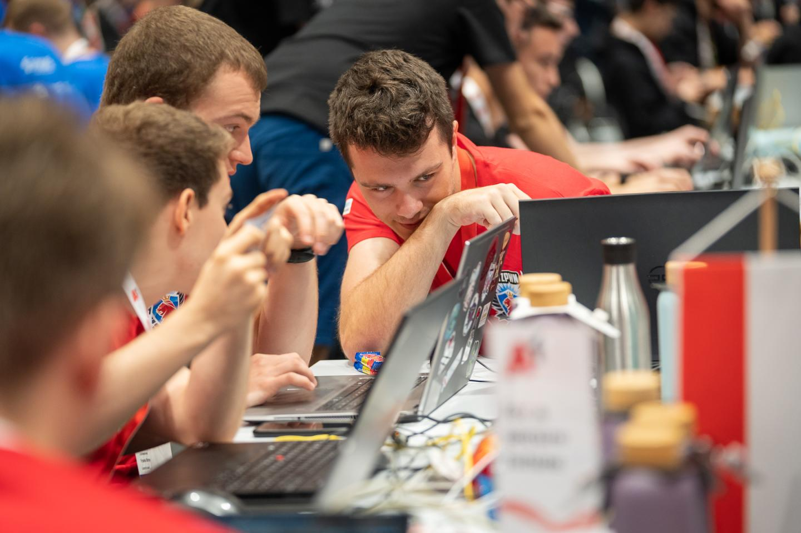
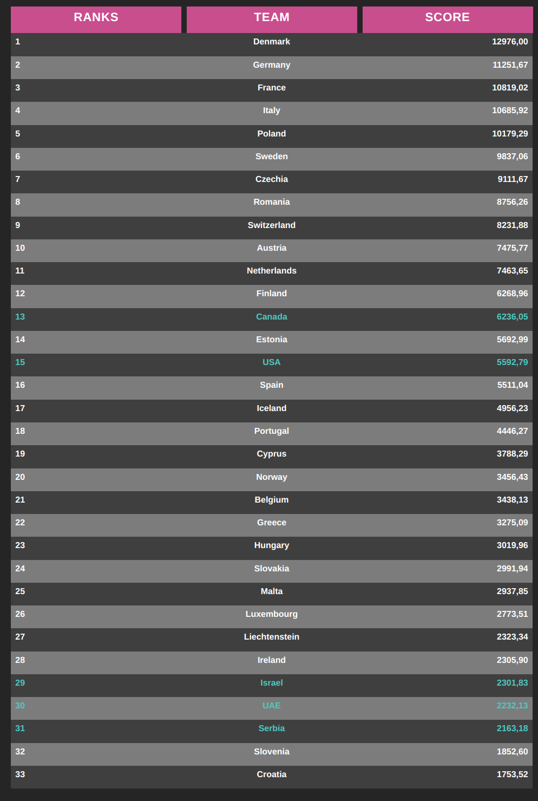

# LetzPwn goes ECSC 2022

### Intro
Every year the ENISA organizes the European cyber security challenge, where top cyber talents from each participating country will meet to network and collaborate and finally compete against each other.

Contestants will be challenged in solving security related tasks, thus a classic CTF-style competition.
This years edition took place in Austria's capital, Vienna. The competition tool place the 14th and 15th of September.

### Team Luxembourg
During the Luxembourg Cyber Security Challenge (LCSC) 2022 we gathered our brightest young CTF-players to participate in the ECSC for team luxembourg.
Together with a two ECSC steering comitee members, a coach and a mentor, the participants made their way to Vienna.

The first day, there was a tricky and fiddly Jeopardy CTF. It included challenges from various categories involving web, crypto, mobile security, reverse engineering and forensics. Furthermore, an escape the box game was designed, where a team of 4 participants from different countries needed to solve tasks collaboratively.

The second day, there was a more stressful Attack/Defense CTF.

Overall, the team placed 26/33, which is a good result that we were very happy with.

