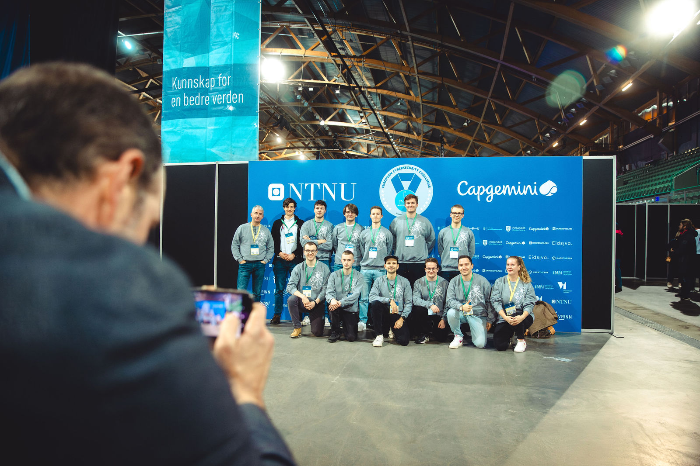
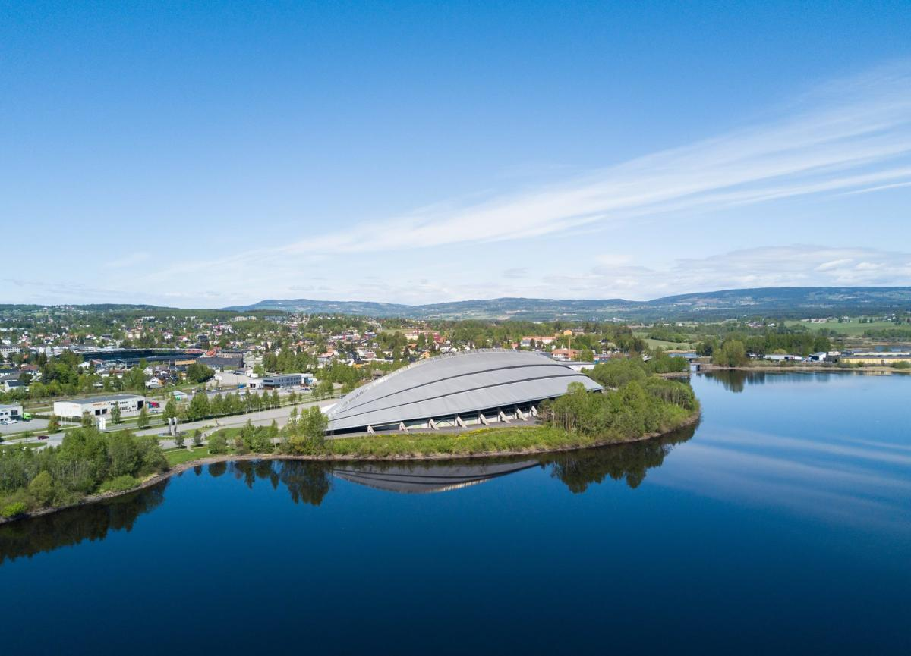
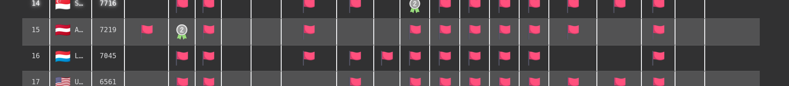
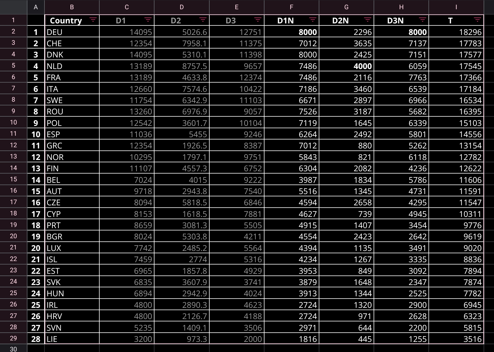
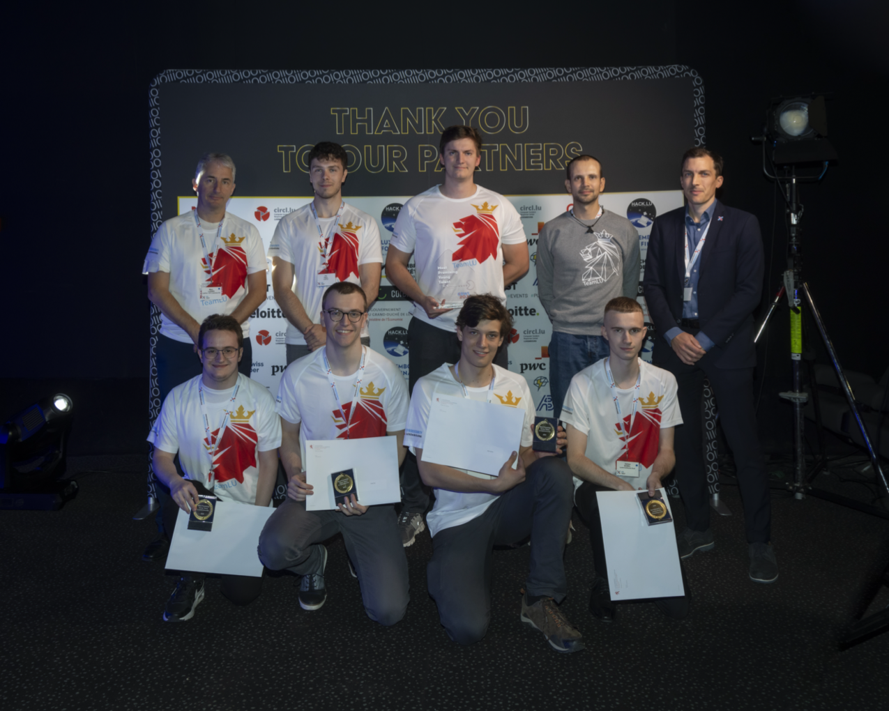

# LetzPwn goes ECSC 2023

### Intro 
Same as last year, and hopefully many years to come, Team Luxembourg competed again against the best young talents from all around Europe in the European Cybersecurity Challenge 2023, organized every year by ENISA. This year, the competition was organized by Norway. It took place in the small city of Hamar from 23rd to 27th October.

Considering the fact that the LetzPwn CTF Team emerged from Luxembourg's first participation in the ECSC back in 2019, LetzPwn provides most of the talents representing Luxembourg. In Hamar, the contestants faced many different challenges in separate styles of competition.

### The Location
The competition took place in Hamar, a small city north of Oslo and right next to Norway's largest lake "Mjøsa". Specifically, the Luxembourgish talents competed against the other teams in the "Vikingskipet", a huge speed skating hall built for the 1994 winter Olympics.

### The competition

The actual competition took place over 3 days. Day 1 was 6.5 hours of Jeopardy-style CTF, Day 2 was 10 hours of Attack-Defense and Day 3 was again 6.5 hours of Jeopardy. All in all, there were 34 countries represented, out of which 28 were EU-member countries while the others were guest countries.

Team Luxembourg started out strong on all 3 days, beating high-caliber teams during the first couple of hours, sometimes placing in the range of 10th-15th place. Towards the end, Team LU usually dropped a little towards ~22nd-3rd out of 34 countries (https://ecsc.no/teams). In the below snapshot, you can see Luxembourg sitting right in Austria's neck, with Team USA behind them:

### Final Scores

Unfortunately, the organizors (and hence also the participants) faced some technical difficulties during the event, particularly during the Attack-Defense part. Due to this, the competition (unofficially) ended a little earlier than expected on the second day.

Nevertheless, the event was fun and engaging, gave many opportunities for connecting with like-minded people from other countries and for Team Luxembourg it was definitely a success!

On the final scoreboard, Team Luxembourg takes the 20th place out of the 28 EU-member countries, which is a significant improvement from the 23rd place which we took last year. Also, considering Luxembourg is the 3rd smallest participating country (behind Liechtenstein and Iceland), we're proud of our achievement and we'll definitely be back next year for more!

Last but not least, we want to express our gratitute to Cybersecurity Luxembourg and their sponsors for making this event possible!

(Some pictures taken from https://emilnyeng.pixieset.com/ecsc2023-hamar/)