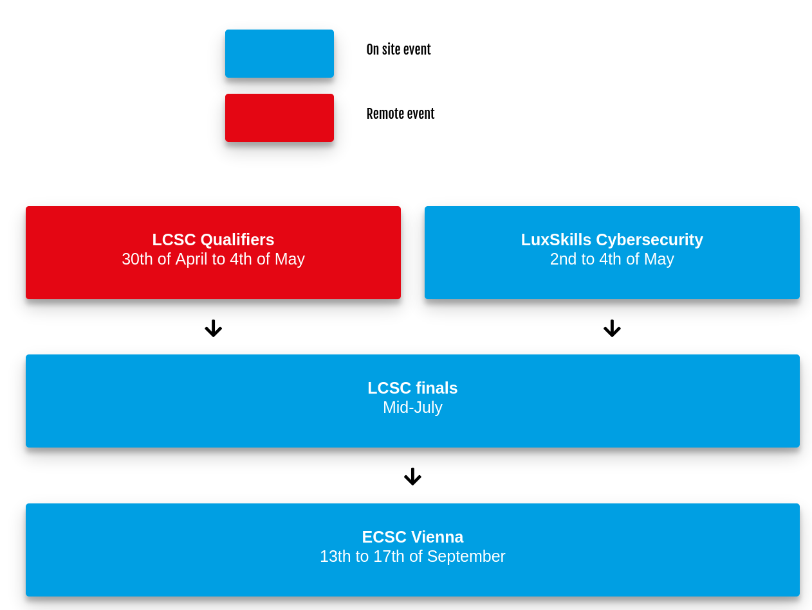

## Hello dear cybersecurity enthusiats, 
Its that time of the year again. The LCSC is starting soon.
As every year, the LCSC is used as a qualification for the national team to participate in the ECSC. 
The most skilled, young Luxembourgish talents get selected for the national team.
                
The LCSC will take place on April 30th until May 4th (non-stop, remotely).
In parallel, the LuxSkills will take place from May 2nd to May 4th (during business hours, on-site).
For more detailed information check out the official [website](https://cybersecurity.lu/challenge). 

Both challenges can make you eligible to participate in the LCSC finale, which will be a on-site event in July in Luxembourg. 
The exact place and date is tbd. The final will a one day challenge in random team of 3-5 people.
Registration for the LCSC qualification round are not officially open yet. But it is encouraged to write an Email to  info@cybersecurity-luxembourg.com with reference LuxSkills or LCSC and by mentioning your name, year of birth and citizenship.
This is needed to check if you are eligible to participate in the ECSC or Worldskills respectively (Note, that for the LCSC quali itself, no age restrictions apply).
For a good overview check out: <a href="https://cybersecurity.lu/challenge?tab=How_to_register">How_to_register</a>.

After having qualified, there will be some awesome coaching with IT-Experts. So stay schwifty.