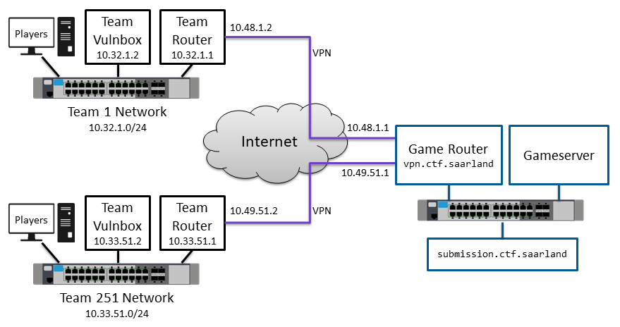

# Setup
This is the setup summary for LetzPwn team for the saarCTF.
A detailed setup configuration can be taken from [here](https://ctf.saarland/setup)

## Summary
|Hosts| IP (range)|
|--------|--------:|
|**Game network:**    |10.32.0.0/15 (10.32.0.0 - 10.33.255.255)  |
|**Team Network:** |10.32.35.0/24 |
|**Router IP:** |10.32.35.1|
|**Vulnbox IP:** |10.32.35.2|
|**Testbox IP:** |10.32.35.3 |



## Team Setup
 The team setup differs a little bit from the image below.
 instead of being in a local network, you are connecting to the openvpn network from the internet.

Details on how you can connect, see the next section.


## How to connect to the network

To connect to the Host machine, download the *team-vpn-client.conf* from the discord *access-control* channel.

Then execute the following command:
```
sudo openvpn --config team-vpn-client.conf
```

If you see an output should say at the end:

```
Initialization Sequence Complete
```

To test the connection, you can try:

```
ping 10.32.250.2
```
If you get an answer, your vpn connection works, nice!
From here you should be able to attack other machines in the network.

## How to connect to the Vulnbox
To patch the own vulnerabilities in our server, you need to have access to the Vulnbox.
First you need to connect to the RouterVM via ssh (password in access-control in discord).
```
ssh root@10.32.35.1
```
From there you can connect to the Vulnbox (or testbox) by running either the *connect_testbox.sh* or the *connect_vulnbox.sh* script to connect to either the vulnbox or the testbox. (The testbox is gonna be offline during the competition. And the vulnbox is gonna be offline before the competition.)

It may be, that you can connect directly to the vulnbox from your PC. ATM that does not work for the testbox. I am not sure why that is or if this is the intended behaviour.

Thus you can try (password in the discord access control):
```
ssh root@10.32.35.3
```

### Questions or problems?
Feel free to contact me (punshLineLama) in the discord server.
